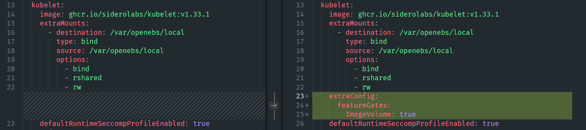
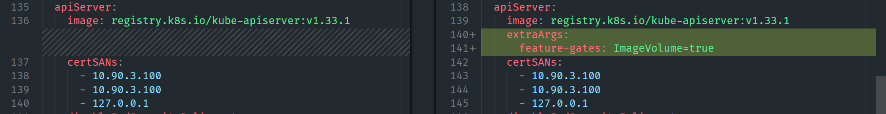

> "When in doubt: `blkdiscard`, `talhelper`, a good `taskfile`, and a mug of coffee...or in my case Musashi Energy - lemonade"

## Why I nuked the cluster

I wanted to simplify how Flux applies applications. Historically the top-level Kustomize for every workload lived inside `flux-system`, which meant lots of cross-namespace references and annoyingly long paths. The plan was to move each app's Flux `Kustomization` into the namespace it actually manages so that `kubernetes/apps/<namespace>/<app>/ks.yaml` is the single source of truth.

That migration touched everything that rolls pods, including storage. Rook-Ceph saw the new manifests, decided that it needed to reconcile, and immediately tripped over the existing OSD data on disk. The net result: the operator kept trying to reformat disks that still held live block devices, the rollout failed in a messy state, and the cluster stopped scheduling anything critical. At that point it was faster (and safer) to pave the nodes and start clean than it was to try to coax Rook back to health while half the controllers were stuck.


I'm assuming you are also doing DR, so you will have the existing CLI tools installed



## Wiping the nodes

I keep a USB stick with `ubuntu-24.04.3-desktop-amd64.iso` around for this exact situation. Live-booting into "Try Ubuntu" gives me a predictable environment, modern nvme-cli, and a desktop for sanity checks. On each node (Stanton-01/02/03) I confirmed the disks with `lsblk`:

```bash
lsblk
```

My Talos install lives on two NVMe devices:

`nvme1n1` (990 GB)
  - The TalosOS Disk
  - Where Open EBS hostpath PVCs live

`nvme0n1` (1.75 TB)
  - Dedicated RookCeph Disk
  - Runs on a [Thunderbolt ring network](https://gist.github.com/gavinmcfall/ea6cb1233d3a300e9f44caf65a32d519)

Once confirmed, I zeroed the flash translation layer and wiped the labels:

```bash
sudo blkdiscard -f /dev/nvme0n1
sudo blkdiscard -f /dev/nvme1n1
sudo wipefs -a /dev/nvme0n1
sudo wipefs -a /dev/nvme1n1
```
### Wiping Disks


Then I ran fdisk to take a look at the NVMEs

```bash
sudo fdisk -l
```

### Running fdisk-l


`blkdiscard` is the important bit for Rook. It makes sure the SSD firmware really forgets the previous partitions, which prevents Ceph from thinking an OSD is already provisioned the next time it boots. A final `lsblk`/`fdisk -l` confirmed that both drives were back to "disk only" with no partitions or filesystems.

What we are looking to see here is that neither disk has any partitions on it (which we do see).
After all the machines are wiped, we are ready to move on.

Power down the machines, remove the Ubuntu media and prep the Talos media.

I should note. I have a dedicated [JetKVM](https://jetkvm.com/products/jetkvm) per Talos Node so I can easily view what the machine is doing, from the browser of my desktop computer. No need for KB/Mouse/Monitor on the actual machines.
In addition, I run the JetKVM [DC Power Control Extension](https://jetkvm.com/products/dc-power-control) so I can remotely power on and off the machines.

## Refreshing the Talos media

All three nodes share the same Talos schematic (`d009fe7b4f1bcd11a45d6ffd17e59921b0a33bc437eebb53cffb9a5b3b9e2992`) which is baked into my existing `talosconfig`. That meant I could download the matching ISO straight from the factory and know it would have the right kernel modules, Thunderbolt NIC support, and SecureBoot bits:

```bash
wget https://factory.talos.dev/image/d009fe7b4f1bcd11a45d6ffd17e59921b0a33bc437eebb53cffb9a5b3b9e2992/v1.11.5/metal-amd64.iso
```

I still write it out with Rufus on a Windows machine because it's the quickest way to prepare three bootable USB sticks. Live-boot Talos, point it at the controller VIP, and wait for maintenance mode.

For this I have 3 Identical Tesla 128GB USB Sticks (Two of which came out of our cars, the 3rd I grabbed from FB Marketplace)


## talhelper, Task, and my bootstrap workflow

Everything from this point lives in [`gavinmcfall/home-ops`](https://github.com/gavinmcfall/home-ops), which keeps Talos, Flux, and the apps in Git. Two files matter for bootstrap:

- `kubernetes/bootstrap/talos/talconfig.yaml` – the talhelper definition of the cluster (VIP `10.90.3.100`, Thunderbolt cross-connects, bonded Intel NICs, etc.).
- `.taskfiles/Talos/Taskfile.yaml` – wraps the talhelper commands so I don't fat-finger args.

The `talos:bootstrap` task is essentially:

```bash
task talos:bootstrap
# expands to:
talhelper gensecret > kubernetes/bootstrap/talos/talsecret.sops.yaml
talhelper genconfig --config-file .../talconfig.yaml --secret-file .../talsecret.sops.yaml --out-dir .../clusterconfig
talhelper gencommand apply --insecure | bash
talhelper gencommand bootstrap | bash
task talos:fetch-kubeconfig
task talos:install-helm-apps
talosctl health --server=false
```

That installs Talos to all three NVMe devices, boots them into the control plane, then waits for etcd to converge. The follow-up `install-helm-apps` task runs `kubernetes/bootstrap/helmfile.yaml`, which deploys the CRDs Cilium needs, Cilium itself, CoreDNS, and Spegel so talosctl can start reporting node health correctly.

Because the Talos VIP and Thunderbolt-only links are described directly inside `talconfig.yaml`, there is nothing manual to do after the ISO is written. The KubePrism SAN, bonded NIC configuration, and node-specific Thunderbolt routes are reapplied automatically. That's the magic of keeping talconfig and the cluster secrets in Git.

### Doing a dry run

Before I actually pipe `talhelper gencommand apply` into `bash`, I like to rehearse the entire sequence so I know Talos will accept the configs:

```bash
cd /home/gavin/home-ops/kubernetes/bootstrap/talos
```

#### 1. Generate configs (safe, local files only)

```bash
talhelper genconfig --config-file talconfig.yaml --secret-file talsecret.sops.yaml --out-dir clusterconfig
```

Output:

```bash
generated config for stanton-01 in clusterconfig/home-kubernetes-stanton-01.yaml
generated config for stanton-02 in clusterconfig/home-kubernetes-stanton-02.yaml
generated config for stanton-03 in clusterconfig/home-kubernetes-stanton-03.yaml
generated client config in clusterconfig/talosconfig
generated .gitignore file in clusterconfig/.gitignore
```

#### 2. Preview the apply/bootstrap commands

```bash
talhelper gencommand apply --extra-flags="--insecure" --config-file talconfig.yaml --out-dir clusterconfig
```

Output:

```bash
talosctl apply-config --talosconfig=clusterconfig/talosconfig --nodes=10.90.3.101 --file=clusterconfig/home-kubernetes-stanton-01.yaml --insecure;
talosctl apply-config --talosconfig=clusterconfig/talosconfig --nodes=10.90.3.102 --file=clusterconfig/home-kubernetes-stanton-02.yaml --insecure;
talosctl apply-config --talosconfig=clusterconfig/talosconfig --nodes=10.90.3.103 --file=clusterconfig/home-kubernetes-stanton-03.yaml --insecure;
```

#### 3. Preview bootstrap command

```bash
talhelper gencommand bootstrap --config-file talconfig.yaml --out-dir clusterconfig
```

Output:

```bash
talosctl bootstrap --talosconfig=clusterconfig/talosconfig --nodes=10.90.3.101;
```

This is expected to only show one node, as Bootstrap initializes the cluster on a single node (stanton-01 in this case) and then the other nodes join it


#### 4. Dry-run each node

```bash
talosctl apply-config --insecure --nodes 10.90.3.101 --file clusterconfig/home-kubernetes-stanton-01.yaml --dry-run
talosctl apply-config --insecure --nodes 10.90.3.102 --file clusterconfig/home-kubernetes-stanton-02.yaml --dry-run
talosctl apply-config --insecure --nodes 10.90.3.103 --file clusterconfig/home-kubernetes-stanton-03.yaml --dry-run
```

Output:

```bash
Dry run summary:
Node is running in maintenance mode and does not have a config yet.
```

If like me you just swap the IP address when typing the command again and forget to swap the file name...
e.g. `talosctl apply-config --insecure --nodes 10.90.3.102 --file clusterconfig/home-kubernetes-stanton-01.yaml --dry-run`

You will get an error:

```bash
talosctl apply-config --insecure --nodes 10.90.3.102 --file clusterconfig/home-kubernetes-stanton-01.yaml --dry-run
error applying new configuration: rpc error: code = InvalidArgument desc = runtime configuration validation failed: 1 error occurred:
        * no disks matched the expression: glob("S73VNU0X303066H", disk.serial) && disk.transport != "" && !disk.readonly &&
!disk.cdrom
```

Make sure if you are going to be lazy, you are also accurate — the dry run is there to catch mistakes before Talos ever touches a disk.

`talhelper genconfig` prints which files were created, while the `gencommand` invocations show the exact `talosctl` commands that `task talos:bootstrap` is about to execute. The last step validates that each node is sitting in maintenance mode and that Talos can match the disk selector defined for that specific host. Once everything looks good it’s time to let the task rip.

## Install Time


\#ifYouKnowYouKnow

The entire process took 6 minutes from the time I typed `task talos:bootstrap` to the time it was done.
You will see connection errors and lots of other "scary" looking things, this is just because this process polls for things that are not "up" yet. Just wait, go make a drink, have a cookie.

### Running `task talos:bootstrap`

```bash
cd /home/gavin/home-ops
task talos:bootstrap
```

`task` runs every command defined in `.taskfiles/Talos/Taskfile.yaml`: it (re)generates Talos secrets if they’re missing, renders configs, applies them to each node, performs the one-time bootstrap on `stanton-01`, downloads the kubeconfig, and applies the bootstrap Helm apps (Cilium/CoreDNS/Spegel). If something fails midway I can rerun the task and it will pick up where it left off.

Output:
```bash
task talos:bootstrap
task: [talos:bootstrap] if [ ! -f "/home/gavin/home-ops/kubernetes/bootstrap/talos/talsecret.sops.yaml" ]; then
    talhelper gensecret > /home/gavin/home-ops/kubernetes/bootstrap/talos/talsecret.sops.yaml
    sops --encrypt --in-place /home/gavin/home-ops/kubernetes/bootstrap/talos/talsecret.sops.yaml
fi

task: [talos:bootstrap] talhelper genconfig --config-file /home/gavin/home-ops/kubernetes/bootstrap/talos/talconfig.yaml --secret-file /home/gavin/home-ops/kubernetes/bootstrap/talos/talsecret.sops.yaml --out-dir /home/gavin/home-ops/kubernetes/bootstrap/talos/clusterconfig
generated config for stanton-01 in /home/gavin/home-ops/kubernetes/bootstrap/talos/clusterconfig/home-kubernetes-stanton-01.yaml
generated config for stanton-02 in /home/gavin/home-ops/kubernetes/bootstrap/talos/clusterconfig/home-kubernetes-stanton-02.yaml
generated config for stanton-03 in /home/gavin/home-ops/kubernetes/bootstrap/talos/clusterconfig/home-kubernetes-stanton-03.yaml
generated client config in /home/gavin/home-ops/kubernetes/bootstrap/talos/clusterconfig/talosconfig
generated .gitignore file in /home/gavin/home-ops/kubernetes/bootstrap/talos/clusterconfig/.gitignore
task: [talos:bootstrap] talhelper gencommand apply --extra-flags="--insecure" --config-file /home/gavin/home-ops/kubernetes/bootstrap/talos/talconfig.yaml --out-dir /home/gavin/home-ops/kubernetes/bootstrap/talos/clusterconfig | bash
task: [talos:bootstrap] until talhelper gencommand bootstrap --config-file /home/gavin/home-ops/kubernetes/bootstrap/talos/talconfig.yaml --out-dir /home/gavin/home-ops/kubernetes/bootstrap/talos/clusterconfig | bash; do sleep 10; done
error executing bootstrap: rpc error: code = Unavailable desc = last connection error: connection error: desc = "transport: Error while dialing: dial tcp 10.90.3.102:50000: connect: connection refused"
error executing bootstrap: rpc error: code = Unavailable desc = last connection error: connection error: desc = "transport: Error while dialing: dial tcp 10.90.3.102:50000: connect: connection refused"
error executing bootstrap: rpc error: code = Unavailable desc = last connection error: connection error: desc = "transport: Error while dialing: dial tcp 10.90.3.103:50000: connect: connection refused"
error executing bootstrap: rpc error: code = Unavailable desc = last connection error: connection error: desc = "transport: Error while dialing: dial tcp 10.90.3.101:50000: connect: connection refused"
error executing bootstrap: rpc error: code = Unavailable desc = last connection error: connection error: desc = "transport: Error while dialing: dial tcp 10.90.3.102:50000: connect: connection refused"
error executing bootstrap: rpc error: code = Unavailable desc = last connection error: connection error: desc = "transport: Error while dialing: dial tcp 10.90.3.102:50000: connect: connection refused"
error executing bootstrap: rpc error: code = Unavailable desc = last connection error: connection error: desc = "transport: Error while dialing: dial tcp 10.90.3.101:50000: connect: connection refused"
error executing bootstrap: rpc error: code = Unavailable desc = last connection error: connection error: desc = "transport: Error while dialing: dial tcp 10.90.3.103:50000: connect: connection refused"
error executing bootstrap: rpc error: code = Unavailable desc = last connection error: connection error: desc = "transport: Error while dialing: dial tcp 10.90.3.102:50000: connect: connection refused"
error executing bootstrap: rpc error: code = Unavailable desc = last connection error: connection error: desc = "transport: Error while dialing: dial tcp 10.90.3.101:50000: connect: connection refused"
error executing bootstrap: rpc error: code = Unavailable desc = last connection error: connection error: desc = "transport: Error while dialing: dial tcp 10.90.3.101:50000: connect: connection refused"
error executing bootstrap: rpc error: code = Unavailable desc = last connection error: connection error: desc = "transport: Error while dialing: dial tcp 10.90.3.102:50000: connect: no route to host"
task: [talos:fetch-kubeconfig] until talhelper gencommand kubeconfig --config-file /home/gavin/home-ops/kubernetes/bootstrap/talos/talconfig.yaml --out-dir /home/gavin/home-ops/kubernetes/bootstrap/talos/clusterconfig --extra-flags="/home/gavin/home-ops --force" | bash; do sleep 10; done
task: [talos:install-helm-apps] until kubectl --kubeconfig /home/gavin/home-ops/kubeconfig wait --for=condition=Ready=False nodes --all --timeout=600s; do sleep 10; done
Unable to connect to the server: dial tcp 10.90.3.100:6443: connect: no route to host
The connection to the server 10.90.3.100:6443 was refused - did you specify the right host or port?
The connection to the server 10.90.3.100:6443 was refused - did you specify the right host or port?
The connection to the server 10.90.3.100:6443 was refused - did you specify the right host or port?
error: no matching resources found
error: no matching resources found
error: no matching resources found
error: no matching resources found
error: no matching resources found
error: no matching resources found
node/stanton-01 condition met
task: [talos:install-helm-apps] helmfile --kubeconfig /home/gavin/home-ops/kubeconfig --file /home/gavin/home-ops/kubernetes/bootstrap/helmfile.yaml apply --skip-diff-on-install --suppress-diff
Adding repo cilium https://helm.cilium.io
"cilium" has been added to your repositories

Adding repo coredns https://coredns.github.io/helm
"coredns" has been added to your repositories

Pulling ghcr.io/prometheus-community/charts/prometheus-operator-crds:24.0.2
Pulling ghcr.io/spegel-org/helm-charts/spegel:0.5.1
Listing releases matching ^prometheus-operator-crds$
Listing releases matching ^coredns$
Listing releases matching ^spegel$
Listing releases matching ^cilium$
Upgrading release=prometheus-operator-crds, chart=/tmp/helmfile4191493076/observability/prometheus-operator-crds/prometheus-operator-crds/24.0.2/prometheus-operator-crds
Release "prometheus-operator-crds" does not exist. Installing it now.
NAME: prometheus-operator-crds
LAST DEPLOYED: Wed Nov 19 10:22:06 2025
NAMESPACE: observability
STATUS: deployed
REVISION: 1
TEST SUITE: None

Listing releases matching ^prometheus-operator-crds$
prometheus-operator-crds        observability   1               2025-11-19 10:22:06.42745174 +1300 NZDT deployed        prometheus-operator-crds-24.0.2  v0.86.2

Upgrading release=cilium, chart=cilium/cilium
Release "cilium" does not exist. Installing it now.
NAME: cilium
LAST DEPLOYED: Wed Nov 19 10:22:10 2025
NAMESPACE: kube-system
STATUS: deployed
REVISION: 1
TEST SUITE: None
NOTES:
You have successfully installed Cilium.

Your release version is 1.18.3.

For any further help, visit https://docs.cilium.io/en/v1.18/gettinghelp

Listing releases matching ^cilium$
cilium  kube-system     1               2025-11-19 10:22:10.403756432 +1300 NZDT        deployed        cilium-1.18.3   1.18.3

Upgrading release=coredns, chart=coredns/coredns
Release "coredns" does not exist. Installing it now.
NAME: coredns
LAST DEPLOYED: Wed Nov 19 10:23:23 2025
NAMESPACE: kube-system
STATUS: deployed
REVISION: 1
TEST SUITE: None
NOTES:
CoreDNS is now running in the cluster as a cluster-service.

It can be tested with the following:

1. Launch a Pod with DNS tools:

kubectl run -it --rm --restart=Never --image=infoblox/dnstools:latest dnstools

2. Query the DNS server:

/ # host kubernetes

Listing releases matching ^coredns$
coredns kube-system     1               2025-11-19 10:23:23.797590616 +1300 NZDT        deployed        coredns-1.45.0  1.13.1

Upgrading release=spegel, chart=/tmp/helmfile4191493076/kube-system/spegel/spegel/0.5.1/spegel
Release "spegel" does not exist. Installing it now.
NAME: spegel
LAST DEPLOYED: Wed Nov 19 10:23:26 2025
NAMESPACE: kube-system
STATUS: deployed
REVISION: 1
TEST SUITE: None

Listing releases matching ^spegel$
spegel  kube-system     1               2025-11-19 10:23:26.188082749 +1300 NZDT        deployed        spegel-0.5.1    v0.5.1


UPDATED RELEASES:
NAME                       NAMESPACE       CHART                                                                VERSION   DURATION
prometheus-operator-crds   observability   oci://ghcr.io/prometheus-community/charts/prometheus-operator-crds   24.0.2          4s
cilium                     kube-system     cilium/cilium                                                        1.18.3       1m13s
coredns                    kube-system     coredns/coredns                                                      1.45.0          3s
spegel                     kube-system     oci://ghcr.io/spegel-org/helm-charts/spegel                          0.5.1          46s

task: [talos:install-helm-apps] until kubectl --kubeconfig /home/gavin/home-ops/kubeconfig wait --for=condition=Ready nodes --all --timeout=600s; do sleep 10; done
node/stanton-01 condition met
node/stanton-02 condition met
node/stanton-03 condition met
task: [talos:bootstrap] talosctl health --server=false
waiting for etcd to be healthy: OK
waiting for etcd members to be consistent across nodes: OK
waiting for etcd members to be control plane nodes: OK
waiting for apid to be ready: OK
waiting for all nodes memory sizes: OK
waiting for all nodes disk sizes: OK
waiting for kubelet to be healthy: OK
waiting for all nodes to finish boot sequence: OK
waiting for all k8s nodes to report: OK
waiting for all k8s nodes to report ready: OK
waiting for all control plane static pods to be running: OK
waiting for all control plane components to be ready: OK
waiting for kube-proxy to report ready: SKIP
waiting for coredns to report ready: OK
waiting for all k8s nodes to report schedulable: OK
```

### Can I see and talk to the cluster?

In your terminal, run:

```bash
talosctl dashboard
```


You can use your keyboard's left and right arrows to cycle through the nodes.
In addition I run k9s and can run this to see my cluster

```bash
k9s
```


The default page takes me to a view of all pods across all namespaces

Holding Shift and pressing `;` will type a `:` which opens the k9s menu.
From here you can type `nodes` and press enter to see the nodes


## Rehydrating GitOps state

Before I do this next step I want to make sure the majority of my cluster is "Off" in Git.
My repo layout is

`home-ops/kubernetes/apps/<namespace>`

Inside each namespace folder is a top-level `kustomization.yaml`
e.g.

```yaml
---
apiVersion: kustomize.config.k8s.io/v1beta1
kind: Kustomization
resources:
  # Pre Flux-Kustomizations
  - ./namespace.yaml
  # Flux-Kustomizations
  # - ./gatus/ks.yaml
  # - ./grafana/ks.yaml
  # - ./kromgo/ks.yaml
  # - ./kube-prometheus-stack/ks.yaml
  # - ./loki/ks.yaml
  # - ./network-ups-tools/ks.yaml
  # - ./prometheus-operator-crds/ks.yaml
  # - ./promtail/ks.yaml
  # - ./redisinsight/ks.yaml
  # - ./unpoller/ks.yaml

  # Exporters
  # - ./exporters
```

You can see here I have commented out everything except the creation of the namespace. This means it won't initially deploy this when I `task flux:bootstrap`

I did this for every namespace except

- cert-manager
- external-secrets
- flux-system
- kube-system
- network
- openebs-system
- volsync-system

Once Talos hands back a kubeconfig (stored at `kubernetes/bootstrap/talos/clusterconfig/talosconfig`), Flux gets bootstrapped with another task:

```bash
task flux:bootstrap
```

Output:

```bash
task flux:bootstrap
task: [flux:bootstrap] kubectl apply --kubeconfig /home/gavin/home-ops/kubeconfig --server-side --kustomize /home/gavin/home-ops/kubernetes/bootstrap/flux
namespace/flux-system serverside-applied
resourcequota/critical-pods-flux-system serverside-applied
customresourcedefinition.apiextensions.k8s.io/alerts.notification.toolkit.fluxcd.io serverside-applied
customresourcedefinition.apiextensions.k8s.io/buckets.source.toolkit.fluxcd.io serverside-applied
customresourcedefinition.apiextensions.k8s.io/externalartifacts.source.toolkit.fluxcd.io serverside-applied
customresourcedefinition.apiextensions.k8s.io/gitrepositories.source.toolkit.fluxcd.io serverside-applied
customresourcedefinition.apiextensions.k8s.io/helmcharts.source.toolkit.fluxcd.io serverside-applied
customresourcedefinition.apiextensions.k8s.io/helmreleases.helm.toolkit.fluxcd.io serverside-applied
customresourcedefinition.apiextensions.k8s.io/helmrepositories.source.toolkit.fluxcd.io serverside-applied
customresourcedefinition.apiextensions.k8s.io/imagepolicies.image.toolkit.fluxcd.io serverside-applied
customresourcedefinition.apiextensions.k8s.io/imagerepositories.image.toolkit.fluxcd.io serverside-applied
customresourcedefinition.apiextensions.k8s.io/imageupdateautomations.image.toolkit.fluxcd.io serverside-applied
customresourcedefinition.apiextensions.k8s.io/kustomizations.kustomize.toolkit.fluxcd.io serverside-applied
customresourcedefinition.apiextensions.k8s.io/ocirepositories.source.toolkit.fluxcd.io serverside-applied
customresourcedefinition.apiextensions.k8s.io/providers.notification.toolkit.fluxcd.io serverside-applied
customresourcedefinition.apiextensions.k8s.io/receivers.notification.toolkit.fluxcd.io serverside-applied
serviceaccount/helm-controller serverside-applied
serviceaccount/image-automation-controller serverside-applied
serviceaccount/image-reflector-controller serverside-applied
serviceaccount/kustomize-controller serverside-applied
serviceaccount/notification-controller serverside-applied
serviceaccount/source-controller serverside-applied
clusterrole.rbac.authorization.k8s.io/crd-controller-flux-system serverside-applied
clusterrole.rbac.authorization.k8s.io/flux-edit-flux-system serverside-applied
clusterrole.rbac.authorization.k8s.io/flux-view-flux-system serverside-applied
clusterrolebinding.rbac.authorization.k8s.io/cluster-reconciler-flux-system serverside-applied
clusterrolebinding.rbac.authorization.k8s.io/crd-controller-flux-system serverside-applied
service/notification-controller serverside-applied
service/source-controller serverside-applied
service/webhook-receiver serverside-applied
deployment.apps/helm-controller serverside-applied
deployment.apps/image-automation-controller serverside-applied
deployment.apps/image-reflector-controller serverside-applied
deployment.apps/kustomize-controller serverside-applied
deployment.apps/notification-controller serverside-applied
deployment.apps/source-controller serverside-applied
task: [flux:bootstrap] cat /home/gavin/home-ops/age.key | kubectl --kubeconfig /home/gavin/home-ops/kubeconfig -n flux-system create secret generic sops-age --from-file=age.agekey=/dev/stdin
secret/sops-age created
task: [flux:bootstrap] sops --decrypt /home/gavin/home-ops/kubernetes/flux/vars/cluster-secrets.sops.yaml | kubectl apply --kubeconfig /home/gavin/home-ops/kubeconfig --server-side --filename -
secret/cluster-secrets serverside-applied
task: [flux:bootstrap] kubectl apply --kubeconfig /home/gavin/home-ops/kubeconfig --server-side --filename /home/gavin/home-ops/kubernetes/flux/vars/cluster-settings.yaml
configmap/cluster-settings serverside-applied
task: [flux:bootstrap] kubectl apply --kubeconfig /home/gavin/home-ops/kubeconfig --server-side --kustomize /home/gavin/home-ops/kubernetes/flux/config
kustomization.kustomize.toolkit.fluxcd.io/cluster serverside-applied
kustomization.kustomize.toolkit.fluxcd.io/flux serverside-applied
gitrepository.source.toolkit.fluxcd.io/home-kubernetes serverside-applied
ocirepository.source.toolkit.fluxcd.io/flux-manifests serverside-applied
```

That command:

1. Applies the manifests under `kubernetes/bootstrap/flux`, including the deploy key secret.
2. Decrypts and applies `flux/vars/cluster-secrets.sops.yaml`.
3. Applies cluster settings and Kustomizations per namespace (`kubernetes/apps/<namespace>/<app>`).


### Disaster...Kinda

Because I am now cut over to Envoy Gateway and not ingress-nginx I am missing the Gateway CRDs because Cilium does not install them (I'm not using Cilium for Gateway API, I'm using Envoy)

Now I could just `kubectl apply -f https://github.com/kubernetes-sigs/gateway-api/releases/download/v1.2.0/standard-install.yaml` and solve the problem... But that's not IAC

So, I created a new folder `home-ops/kubernetes/apps/network/gateway-api`

```bash
.
├── app
│   └── kustomization.yaml
└── ks.yaml
```

That `kustomization.yaml` is fairly simple. Its job is to install the Gateway API CRDs

```yaml
---
apiVersion: kustomize.config.k8s.io/v1beta1
kind: Kustomization
resources:
  - https://github.com/kubernetes-sigs/gateway-api/releases/download/v1.2.0/standard-install.yaml
```

owever, I need these installed before Envoy so In`kubernetes/apps/network/envoy-gateway/ks.yaml` I had to add a `dependsOn:`

```yaml
---
# yaml-language-server: $schema=https://kubernetes-schemas.ok8.sh/kustomize.toolkit.fluxcd.io/kustomization_v1.json
apiVersion: kustomize.toolkit.fluxcd.io/v1
kind: Kustomization
metadata:
  name: &app envoy-gateway
  namespace: flux-system
spec:
  targetNamespace: &namespace network
  commonMetadata:
    labels:
      app.kubernetes.io/name: *app
  interval: 1h
  path: ./kubernetes/apps/network/envoy-gateway/app
  prune: true
  sourceRef:
    kind: GitRepository
    name: home-kubernetes
  timeout: 15m
  dependsOn:
    - name: gateway-api
```

Now this comes up first, then Envoy.

Sometimes things come up a little out of order, especially where CRDs are concerned. best bet is to check things and reconcile if needed. Example

`envoy-gateway` came up (the main Helm Release and installed the CRDs) but the dry run failed for `envoy-gateway-config`

All I had to do is:

```bash
flux reconcile kustomization envoy-gateway-config --with-source
```

And the Ks `Applied Revision` and the rest of Envoy rolled out

## Rook-Ceph DR Recovery: Why It Wouldn't Start

### Issue 1: Cleanup Policy Blocking Orchestration

**Symptom:** Operator logs showed:

```bash
skipping orchestration for cluster object "rook-ceph" because its cleanup policy is set
```

**Cause:** The CephCluster spec had `cleanupPolicy.confirmation: yes-really-destroy-data` set. When this field is present, Rook interprets it as "this cluster is being deleted" and skips all orchestration entirely. Fix: Removed from `helmrelease.yaml:`

- confirmation: yes-really-destroy-data
- wipeDevicesFromOtherClusters: true

Since the HelmRelease was stuck reinstalling, we also patched directly:

```bash
kubectl patch cephcluster -n rook-ceph rook-ceph --type=json \
  -p='[{"op": "remove", "path": "/spec/cleanupPolicy/confirmation"},
       {"op": "remove", "path": "/spec/cleanupPolicy/wipeDevicesFromOtherClusters"}]'
```

### Issue 2: OSD Network Configuration Failure

**Symptom:** OSD pods in CrashLoopBackOff with:

```bash
unable to find any IPv4 address in networks '169.254.255.0/24' interfaces ''
Failed to pick cluster address.
```

**Cause:** The Ceph cluster was configured to use 169.254.255.0/24 (Thunderbolt mesh) for cluster traffic, but the Thunderbolt interfaces weren't up - the kernel showed timeout errors trying to communicate with the Thunderbolt controller. Fix:


1. Replugged the Thunderbolt cables between nodes
1. Verified interfaces came up with correct IPs (169.254.255.101/32)
1. Temporarily patched cluster network to use main network while Thunderbolt was down:

```bash
kubectl patch cephcluster -n rook-ceph rook-ceph --type=json \
  -p='[{"op": "replace", "path": "/spec/network/addressRanges/cluster", "value": ["10.90.0.0/16"]}]'
```

### Lessons Learned

1. `cleanupPolicy.confirmation` **is a deletion flag** - Only set it when you actually want to destroy the cluster
1. **Check physical connectivity** - Thunderbolt timeouts in dmesg indicate cable/connection issues
1. **Network config must match available interfaces** - OSDs can't start if they can't find an IP in the configured cluster network range


The layout change that started this mess is still worth doing, so I'm re-introducing it carefully:

- Each namespace owns its Flux `Kustomization` (`ks.yaml` in the namespace folder).
- Reconciles happen namespace-by-namespace with `task flux:apply path=rook-ceph/cluster ns=rook-ceph`.
- Critical infrastructure (Talos bootstrap Helm releases + Flux) never reference manifests outside their namespace so I can fence blast-radius.

Once Flux is healthy I let VolSync and CloudNativePG pull data back from object storage, which rebuilds PVCs long before Rook redeploys fresh OSDs.

## Next Steps

### Roll out Database Namespace

My Database Namespace contains

- Cloudnative PG (Postgres)
- Dragonfly DB (Redis) - Currently blocking the rollout of OAuth2Proxy which depends on this
- Maria DB (My SQL)
- Mosquitto (MQTT Message Broker)

For this, I will edit the `kustomization.yaml` in the `Database` namespace to uncomment the paths

```yaml
---
# yaml-language-server: $schema=https://json.schemastore.org/kustomization
apiVersion: kustomize.config.k8s.io/v1beta1
kind: Kustomization
resources:
  # Pre Flux-Kustomizations
  - ./namespace.yaml
  # Flux-Kustomizations
  - ./cloudnative-pg/ks.yaml
  - ./dragonfly/ks.yaml
  - ./mosquitto/ks.yaml
  - ./mariadb/ks.yaml
```

### Postgres restore

In Backblaze I have my Postgres Backups


and in my Cloudnative Postgres cluster config I have my restore settings: `kubernetes/apps/database/cloudnative-pg/cluster17/cluster17.yaml`

```yaml
  backup:
    retentionPolicy: 60d
    barmanObjectStore: &barmanObjectStore
      data:
        compression: bzip2
      wal:
        compression: bzip2
        maxParallel: 8
      destinationPath: s3://nerdz-cloudnative-pg/
      endpointURL: https://s3.us-east-005.backblazeb2.com
      serverName: &currentCluster postgres17-v3
      s3Credentials:
        accessKeyId:
          name: cloudnative-pg-secret
          key: aws-access-key-id
        secretAccessKey:
          name: cloudnative-pg-secret
          key: aws-secret-access-key
  # Note: externalClusters is needed when recovering from an existing cnpg cluster
  bootstrap:
    recovery:
      source: &previousCluster postgres17-v2
  # Note: externalClusters is needed when recovering from an existing cnpg cluster
  externalClusters:
    - name: *previousCluster
      barmanObjectStore:
        <<: *barmanObjectStore
        serverName: *previousCluster
```

This tells Postgres to grab the data from `postgres17-v2` in backblaze and to build a new cluster called `postgres17-v3` and sync that to backblaze.

### MariaDB: when charts won't behave

MariaDB should have been the easy part. The upgrade from Bitnami’s 22.x chart to 23.x surfaced two separate gotchas:

1. Bitnami yanked the old `12.0.2-debian-12-r0` image tags, so the kubelet couldn’t pull the default container anymore.
2. The new chart force-enables FIPS templating and renders two `env` sections in the mysqld-exporter sidecar whenever metrics are on, which makes Flux’s post-render stage blow up before anything gets applied.

How I pulled it back:

- Temporarily pinned the MariaDB, volume-permissions, and mysqld-exporter containers to known-good digests so the cluster stayed alive while I figured out 23.x.
- Added `global.defaultFips: "off"` plus explicit `"off"` overrides for `primary`, `volumePermissions`, and `metrics` FIPS blocks so Helm would render the new manifests.
- Disabled the chart’s built-in metrics and stood up my own exporter Deployment + Service + ServiceMonitor (now in `kubernetes/apps/observability/exporters/mariadb-exporter`). It still runs in the `database` namespace, reads `mariadb-secret`, and Prometheus keeps scraping through the ServiceMonitor.
- Once everything was committed, I suspended/resumed the HelmRelease to clear Flux’s stuck rollout and let the StatefulSet recreate cleanly.

It’s not glamorous, but it gets MariaDB onto chart 23.2.4 without losing metrics, and every moving piece is now in Git so the next rebuild will just be another `task flux:apply`.

### Continuation - More namespaces coming online

Now that MariaDB was sorted I moved on to enabling the next lot of namespaces

1. Observability (exporters, gatus, grafana, kromgo, kube-prometheus-stack, loki, network-ups-tools, promtail, redis insights and unpoller)
1. Then the security namespace (pocket-id)
  1. This allowed me to kick the oauth2proxy pods which were crashlooping and get them running again
1. except... :sob:

### oauth2-proxy Hairpin NAT and the Gateway API Version Maze

With pocket-id running I expected oauth2-proxy to come up cleanly. Instead all three replicas crashed with OIDC discovery timeouts trying to reach `id.${SECRET_DOMAIN}`. The culprit: hairpin NAT. Pods on the same node as the external gateway couldn't reach its LoadBalancer IP (`10.90.3.201`) and curl just hung.

The classic fix is split-horizon DNS—have CoreDNS forward queries for your domain to an internal resolver that returns ClusterIPs instead of the external gateway. I already had k8s-gateway deployed at `10.96.100.130`, so I added a server block to CoreDNS:

```yaml
servers:
  - zones:
      - zone: ${SECRET_DOMAIN}
        scheme: dns://
    port: 53
    plugins:
      - name: forward
        parameters: . 10.96.100.130
```

That should have been the end of it, but k8s-gateway refused to serve queries:

```
plugin/k8s_gateway: Could not sync required resources
failed to list *v1alpha2.GRPCRoute
```

k8s-gateway v0.4.0 hardcodes a watch on `v1alpha2.GRPCRoute`, but I was running Gateway API v1.2.0 which only ships `v1.GRPCRoute`. The experimental bundle doesn't help—v1alpha2 was removed in v1.1.0+.

**The fix required threading a needle between multiple version requirements:**

1. **Envoy Gateway v1.6.0** needs `BackendTLSPolicy` at API version `v1`, which only exists in Gateway API ≥v1.4.0
2. **k8s-gateway v0.4.0** needs `v1alpha2.GRPCRoute`, which was removed in Gateway API v1.1.0+

The solution is to use Gateway API v1.4.0 experimental (for BackendTLSPolicy v1) and patch the GRPCRoute CRD to add v1alpha2 back. See the "Permanent Fix: JSON Patch for v1alpha2.GRPCRoute" section below for the full solution.

But I wasn't done. k8s-gateway was only watching `Ingress` and `Service` resources. pocket-id uses Gateway API HTTPRoutes for ingress, so k8s-gateway had no idea `id.${SECRET_DOMAIN}` existed:

```yaml
# kubernetes/apps/network/k8s-gateway/app/helmrelease.yaml
watchedResources: ["Ingress", "Service", "HTTPRoute"]
```

One more gotcha: deleting and recreating the Gateway API CRDs wiped out all existing HTTPRoute resources, and Helm didn't know to recreate them since the release checksum hadn't changed. I had to manually reapply from the helm manifest:

```bash
helm get manifest -n security pocket-id | kubectl apply -f -
```

After all that, DNS finally resolved:

```
$ nslookup id.${SECRET_DOMAIN}
Name:   id.${SECRET_DOMAIN}
Address: 10.90.3.201
```

And oauth2-proxy came up healthy:

```
NAME                           READY   STATUS    RESTARTS   AGE
oauth2-proxy-f7f87f84b-lhwx9   1/1     Running   0          28s
oauth2-proxy-f7f87f84b-q4n7s   1/1     Running   0          28s
oauth2-proxy-f7f87f84b-t5j6l   1/1     Running   0          28s
```

## Gateway API Version Hell: BackendTLSPolicy and WebSocket Drama

Just when I thought I was done, external services started failing. TrueNAS and Unifi were returning 400 Bad Request errors on WebSocket connections. The UI would load, but any real-time features (shell, charts, live updates) were dead.

### The Problem

Envoy Gateway v1.6.0 expects `BackendTLSPolicy` at API version `gateway.networking.k8s.io/v1`, but Gateway API v1.1.0 experimental only ships v1alpha3. Meanwhile, k8s-gateway v0.4.0 hardcodes watching for `v1alpha2.GRPCRoute` which doesn't exist in newer Gateway API releases.

The operator logs were clear:

```
BackendTLSPolicy CRD not found, skipping BackendTLSPolicy watch
```

This meant Envoy wasn't applying TLS settings to the backends at all.

### The Fix (and the Trap)

Upgrading Gateway API to v1.4.0 experimental brought in BackendTLSPolicy v1 (see the full kustomization.yaml with the GRPCRoute JSON patch in the "Permanent Fix" section below).

Updated the BackendTLSPolicy resources from v1alpha3 to v1, removed the `namespace` field from targetRefs (v1 doesn't have it), and removed `sectionName` to apply TLS to all service ports.

But then WebSockets broke. I spent an hour chasing the wrong fix—removing `useClientProtocol: true` thinking it was sending HTTP/2 to HTTP/1.1-only backends. Wrong move.

The original working config (pre-wipe) had:

```yaml
spec:
  useClientProtocol: true
```

This setting is essential for WebSocket support. When a client initiates an HTTP/1.1 WebSocket upgrade, Envoy needs to forward that same protocol to the backend. Removing it caused Envoy to use its default protocol (HTTP/2 with ALPN), which the backends rejected.

WebSocket support is handled by `useClientProtocol: true` in the BackendTrafficPolicy—it allows Envoy to forward the client's HTTP/1.1 upgrade request using the same protocol.

### Permanent Fix: JSON Patch for v1alpha2.GRPCRoute

After fighting this multiple times (every Flux reconciliation would remove the manually-applied CRD), I finally found a permanent solution. The problem is that k8s-gateway v0.4.0 hardcodes a watch on `v1alpha2.GRPCRoute`, but Gateway API v1.1.0+ only ships `v1.GRPCRoute`.

You can't just add the old CRD as a separate resource—Kustomize will fail with "may not add resource with an already registered id" because both define the same CRD name.

The fix is to use a **JSON patch** to append v1alpha2 as an additional version to the existing GRPCRoute CRD:

```yaml
# kubernetes/apps/network/gateway-api/app/kustomization.yaml
---
apiVersion: kustomize.config.k8s.io/v1beta1
kind: Kustomization
resources:
  - https://github.com/kubernetes-sigs/gateway-api/releases/download/v1.4.0/experimental-install.yaml
patches:
  # k8s-gateway v0.4.0 requires v1alpha2.GRPCRoute which was removed in Gateway API v1.1.0+
  # Use JSON patch to ADD v1alpha2 version without replacing existing v1
  - target:
      kind: CustomResourceDefinition
      name: grpcroutes.gateway.networking.k8s.io
    patch: |-
      - op: add
        path: /spec/versions/-
        value:
          name: v1alpha2
          served: true
          storage: false
          schema:
            openAPIV3Schema:
              type: object
              properties:
                spec:
                  type: object
                status:
                  type: object
```

This approach:
1. Pulls Gateway API v1.4.0 experimental (with v1.GRPCRoute and BackendTLSPolicy v1)
2. Uses `op: add` with `path: /spec/versions/-` to append v1alpha2 to the versions array
3. Keeps v1 as the storage version while serving v1alpha2 for k8s-gateway

Now when Flux reconciles, k8s-gateway finds its required `v1alpha2.GRPCRoute` and stops complaining. No more manual patching after reconciliations.

**Lessons learned:**

- Gateway API version compatibility is a minefield. k8s-gateway, Envoy Gateway, and external-dns all have different requirements. Pin to v1.4.0 experimental for BackendTLSPolicy v1 support with Envoy Gateway v1.6.0.
- Always add HTTPRoute to k8s-gateway's `watchedResources` if you're using Gateway API for ingress.
- CRD deletions cascade to all CR instances. After recreating CRDs, you need to force Helm to reapply resources even if the chart version hasn't changed.
- **Don't remove `useClientProtocol: true` from BackendTrafficPolicy** – it's required for WebSocket connections to work properly. When in doubt, check the original working config before making changes.
- **Use JSON patches to add CRD versions** – when you need to support multiple API versions in a single CRD, use Kustomize JSON patches with `op: add` to append versions without replacing the original.

### Hairpin NAT and Cilium socketLB

After all the Gateway API CRD drama, I hit another wall: pods couldn't reach services on the external gateway. BookStack's OIDC login to PocketID was timing out with `cURL error 6: Could not resolve host: id.nerdz.cloud`.

The symptoms were confusing:
- DNS resolved correctly via k8s-gateway (returning the LoadBalancer IP)
- The pod could reach the service directly via ClusterIP
- But any attempt to curl the LoadBalancer IP from inside the cluster timed out

This is the classic **hairpin NAT problem**. With ingress-nginx, this worked because it runs with `hostNetwork: true`, so traffic never goes through the LoadBalancer service from inside the cluster. But Envoy Gateway deploys proxies as regular pods without hostNetwork, so internal traffic trying to reach the LoadBalancer IP gets stuck.

The fix? **Enable Cilium's socketLB**. This allows pods to reach LoadBalancer IPs directly by doing socket-level interception:

```yaml
# kubernetes/apps/kube-system/cilium/app/helm-values.yaml
socketLB:
  enabled: true
```

Before this change, `bpf-lb-sock` was `false` in the cilium-config ConfigMap. After enabling it, pods can reach any LoadBalancer IP in the cluster, including the external gateway where PocketID lives.

I also added an internal HTTPRoute to pocket-id as a belt-and-suspenders approach, so k8s-gateway returns both the internal and external gateway IPs. But the real fix was enabling socketLB.

**Lesson learned:** If you're using Cilium with Envoy Gateway (or any ingress that doesn't use hostNetwork), you need `socketLB.enabled: true` for pod-to-LoadBalancer connectivity.


### Rook Ceph: clearing the “too many PGs per OSD” alert

Even on the fresh Talos rebuild, Ceph immediately threw `HEALTH_WARN too many PGs per OSD (265 > max 250)`. With only three NVMe-backed OSDs online, the default PG soft limit is tight, so any extra pools tip it over. The culprit was the **bootstrap RGW realm** (`default`) that Rook creates every time, even if you never intend to use it.

What I did:

1. **Confirmed the warning was PG-related** – `kubectl -n rook-ceph exec deploy/rook-ceph-tools -- ceph status` showed 265 PGs spread across 15 pools, all OSDs healthy.
2. **Inspected pool usage** – `ceph df detail` revealed `default.rgw.(log|control|meta)` sucking up 96 PGs despite having zero data.
3. **Verified the realm was unused** – `radosgw-admin realm/zonegroup/zone list` only reported `ceph-objectstore` as active; the old `default` entries had no buckets or users (`radosgw-admin bucket list --rgw-zone=default` returned `[]`).
4. **Deleted the bootstrap realm stack** – removed the `default` zonegroup + zone, ran `radosgw-admin period update --commit`, then dropped the three empty pools with:

   ```bash
   ceph osd pool rm default.rgw.log default.rgw.log --yes-i-really-really-mean-it
   ceph osd pool rm default.rgw.control default.rgw.control --yes-i-really-really-mean-it
   ceph osd pool rm default.rgw.meta default.rgw.meta --yes-i-really-really-mean-it
   ```

5. **Rechecked cluster health** – PG count fell to 169 and `ceph status` flipped back to `HEALTH_OK`.

Lesson learned: after every fresh Rook install, delete the unused `default` RGW realm or scale up OSDs before enabling your workloads. Otherwise Ceph wastes PGs on pools you don’t even mount, and you get an avoidable health warning the moment the cluster comes online.

I'm still in the middle of rebuilding, but wiping the nodes and re-running the Talos + Flux bootstrap took under an hour once the ISO was ready. The longest part was downloading backups and letting VolSync rehydrate PVCs. If you ever reach the point where Rook is fighting ghost disks, don't be afraid to pave the nodes. Talos makes the clean-room reinstall repeatable, and GitOps brings all of the workloads back on autopilot.


### Discovering ImageVolume: OCI images as read-only config volumes

While getting qbittorrent running, I noticed it was using something I didn't know existed: the `type: image` persistence option in bjw-s's app-template. It lets you mount an OCI image directly as a read-only volume—perfect for bundling binaries or config without maintaining separate ConfigMaps or init containers.

The qbittorrent helmrelease mounts qbrr (a torrent reannounce tool) this way:

```yaml
persistence:
  qbrr:
    type: image
    image: ghcr.io/buroa/qbrr:0.1.2@sha256:f930dbb4de49ffe3348d1d4f8187ce27590842bc4d6a89c3aa84234d7e99f46b
    globalMounts:
      - readOnly: true
```

This pulls the OCI image and mounts its filesystem as a read-only volume—qbittorrent gets access to the qbrr binary without needing an init container to copy it over. The catch? It requires the Kubernetes `ImageVolume` feature gate, which is alpha and disabled by default.

#### Enabling ImageVolume on Talos

Enabling a Kubernetes feature gate on Talos means patching both the kubelet (on all nodes) and the API server (on control plane nodes). I followed MASTERBLASTER's pattern from their home-ops repo.

**Step 1: Create the controller patch for the API server**

File: `kubernetes/bootstrap/talos/patches/controller/feature-gates.yaml`

```yaml
cluster:
  apiServer:
    extraArgs:
      feature-gates: ImageVolume=true
```

**Step 2: Update the kubelet patch**

Added to the existing `kubernetes/bootstrap/talos/patches/global/kubelet.yaml`:

```yaml
machine:
  kubelet:
    nodeIP:
      validSubnets:
        - 10.90.3.0/16
    extraConfig:
      featureGates:
        ImageVolume: true
```

**Step 3: Reference the new patch in talconfig.yaml**

Added `"@./patches/controller/feature-gates.yaml"` to the controlPlane patches list.

#### Rolling out the change safely

Talos machineconfig changes can be risky—a bad config can brick your nodes. I took a cautious approach with full backups and validation at each step.

**1. Document current state**

First, verify no feature gates are currently configured:

```bash
# Check kubelet feature gates on all nodes
for node in 10.90.3.101 10.90.3.102 10.90.3.103; do
  echo "--- Node $node ---"
  talosctl -n $node get machineconfig -o yaml | grep -A2 featureGates
done

# Check API server feature gates
kubectl get pod -n kube-system -l component=kube-apiserver -o yaml | grep feature-gates
```

All nodes returned empty—no feature gates configured.

**2. Backup existing configs before changes**

```bash
cd /home/gavin/home-ops/kubernetes/bootstrap/talos

# Copy current machineconfigs
cp -r clusterconfig clusterconfig-before-imagevolume

# Copy patch files we're modifying
cp patches/global/kubelet.yaml kubelet-before-imagevolume.yaml
cp talconfig.yaml talconfig-before-imagevolume.yaml
```

**3. Generate new configs and compare**

```bash
# Generate new machineconfigs
talhelper genconfig

# Compare old vs new (or use VS Code diff)
diff clusterconfig-before-imagevolume/home-kubernetes-stanton-01.yaml \
     clusterconfig/home-kubernetes-stanton-01.yaml
```

Here's what the diffs look like in VS Code:

**Kubelet patch** – adds `extraConfig.featureGates.ImageVolume: true`:



**API server patch** – adds `extraArgs.feature-gates: ImageVolume=true`:



**4. Dry-run first node**

Test the config without applying to catch any errors:

```bash
export TALOSCONFIG=/home/gavin/home-ops/kubernetes/bootstrap/talos/clusterconfig/talosconfig
talosctl apply-config -n 10.90.3.101 -f clusterconfig/home-kubernetes-stanton-01.yaml --dry-run
```

The dry-run output showed exactly what would change:

```
Dry run summary:
Applied configuration without a reboot (skipped in dry-run).
Config diff:
+        extraConfig:
+            featureGates:
+                ImageVolume: true
...
+        extraArgs:
+            feature-gates: ImageVolume=true
```

**5. Apply one node at a time**

Start with the first node, wait for it to return to Ready, then proceed:

```bash
# Apply to first node
talosctl apply-config -n 10.90.3.101 -f clusterconfig/home-kubernetes-stanton-01.yaml

# Watch for Ready status
kubectl get nodes -w

# Verify feature gate applied
talosctl -n 10.90.3.101 get machineconfig -o yaml | grep -A2 featureGates
```

**6. Apply to remaining nodes**

Only after stanton-01 is confirmed healthy:

```bash
# Second node
talosctl apply-config -n 10.90.3.102 -f clusterconfig/home-kubernetes-stanton-02.yaml
kubectl get nodes -w

# Third node
talosctl apply-config -n 10.90.3.103 -f clusterconfig/home-kubernetes-stanton-03.yaml
kubectl get nodes -w
```

All three nodes applied the config without requiring a reboot—Talos intelligently determines whether kubelet/API server changes need a full reboot or just a service restart.

#### Validating the feature works

With the feature gate enabled, I force-reconciled the qbittorrent helmrelease (the `--force` flag ensures Helm reapplies the deployment even if the chart version hasn't changed):

```bash
flux reconcile helmrelease -n downloads qbittorrent --force
kubectl rollout status deployment/qbittorrent -n downloads --timeout=120s
```

Once the pod came up, I verified the image volume was mounted and the binary was accessible:

```bash
# Check the qbrr volume is mounted
kubectl exec -n downloads deploy/qbittorrent -c app -- ls -la /qbrr/
```

Output shows the entire OCI image filesystem mounted read-only:

```
total 2072
drwxr-xr-x 1 root root       6 Nov 20 12:03 .
drwxr-xr-x 1 root root      40 Nov 20 12:03 ..
drwxr-xr-x 2 root root       6 Aug 25 04:05 bin
...
-rwxr-xr-x 1 root root 2118668 Nov 18 05:15 qbrr
...
```

And verify the binary is executable:

```bash
kubectl exec -n downloads deploy/qbittorrent -c app -- /qbrr/qbrr --help
```

```
Usage of /qbrr/qbrr:

qBittorrent reannouncement tool

  -hash string
    	Specific torrent hash to reannounce (single run mode)
  -interval int
    	Interval between reannounce checks in seconds (default 7)
  ...
```

The ImageVolume feature is working—the qbrr binary is available at `/qbrr/qbrr` without any init containers or volume copying.

**Lesson learned:** `type: image` persistence is a cleaner pattern for shipping binaries or config alongside your main container. You avoid init containers that copy files around, and the volume is immutable. The feature gate requirement means it's not for everyone, but on a homelab where you control the cluster config, it's worth enabling.


## Guardrails I'm putting in place

1. **Wipe before redeploying storage** – running `blkdiscard` and `wipefs` is now part of the Taskfile `talos:nuke` flow so Ceph never trips on residual GPT headers again.
2. **Namespace-scoped Flux Kustomize** – large-scale reorganizations happen behind feature branches and are reconciled one namespace at a time instead of flipping the entire cluster at once.
3. **Talos factory IDs in version control** – keeping the Talos schematic IDs and Thunderbolt routes in `talconfig.yaml` meant the reinstall was deterministic. Future upgrades will keep those comments updated so I always know what ISO to pull.
4. **Document the scary steps** – posts like this become my runbook. The next time Talos needs to be rebuilt I can follow the exact steps—Ubuntu live boot, `blkdiscard`, `task talos:bootstrap`, `task flux:bootstrap`—without searching through old Discord threads.
