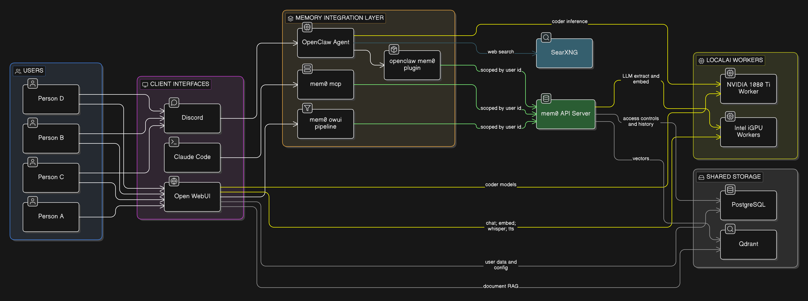

> "The best AI assistant isn't the smartest one. It's the one that remembers you told it not to do that thing last Tuesday."

## Intro

It's been a while since [Part 3](https://gavinmcfall.github.io/nerdzblog/2025/deploying-open-llms-03/) where I got Ollama running as a DaemonSet with shared storage across my three MS-01 nodes. That setup worked, but it had some fundamental limitations that started bugging me:

1. **No GPU heterogeneity** — All three MS-01 nodes have Intel UHD 770 iGPUs. When I added pyro-01 (with a GTX 1080 Ti) to the cluster, Ollama had no way to federate inference across different GPU types.
2. **No load balancing** — Requests hit whichever pod the service routed to. No awareness of which node was busy or idle.
3. **No memory** — Every conversation started from zero. The AI had no idea who I was, what we'd talked about, or what I'd asked it to remember.

That last one is the big one. I don't just want a chatbot — I want an AI stack that builds context over time, across every interface I use.

So I ripped it all out and started over.

## Why LocalAI?

[LocalAI](https://github.com/mudler/LocalAI) is an OpenAI-compatible API server that runs locally, similar to Ollama. But it has some features that make it significantly more interesting for a multi-node homelab:

### Heterogeneous GPU Support

My cluster has two types of GPU hardware:

| Node | GPU | VRAM | LocalAI Image |
|------|-----|------|---------------|
| ms-01 (x3) | Intel UHD 770 (iGPU) | Shared 16GB RAM | `gpu-intel` (SYCL/oneAPI) |
| pyro-01 | NVIDIA GTX 1080 Ti | 11GB GDDR5X | `gpu-nvidia-cuda-12` |

LocalAI has dedicated container images for each GPU vendor. Different images, same API. Each worker loads models suited to its hardware.

### OpenAI-Compatible API

Just like Ollama, LocalAI exposes `/v1/chat/completions`, `/v1/embeddings`, and all the standard OpenAI endpoints. Any tool that speaks OpenAI can talk to LocalAI without modification.

### Memory Reclaimer

LocalAI can automatically evict idle models from memory when resources get tight. On constrained hardware (Intel iGPUs sharing system RAM), this is essential. Ollama would just OOM-kill.

### P2P Federation (The Feature I Wanted But Couldn't Use)

LocalAI advertises P2P federation using [edgevpn](https://github.com/mudler/edgevpn) and [libp2p](https://github.com/libp2p/go-libp2p) — a CPU-only load balancer that discovers GPU workers via a DHT mesh. Workers join the network with a shared token, and the LB routes requests automatically.

This was the killer feature that sold me on LocalAI. It didn't work. More on that below.

## The P2P Federation Trap

I spent significant time building out a P2P federated setup:
- A CPU-only load balancer running `local-ai federated`
- Intel workers running `local-ai run --p2p --federated`
- An NVIDIA worker running the same
- A shared edgevpn token (base64-encoded YAML with room, rendezvous, mDNS, and OTP keys) via ExternalSecret

The LB started fine. EdgeVPN initialized, DHT bootstrapped, and it listened on port 8080. Then it spammed `No available nodes yet` for 20+ minutes and never found a single worker.

### Why P2P Fails in Kubernetes

The edgevpn DHT bootstrap mechanism relies on two discovery methods:

1. **mDNS** — Uses UDP multicast to `224.0.0.251:5353`. Works on a LAN. **Does not work across Kubernetes nodes.** Each pod has its own network namespace; multicast doesn't cross node boundaries in Cilium (or most CNIs).

2. **DHT via public IPFS bootstrap nodes** — Falls back to `bootstrap.libp2p.io:4001` when no custom bootstrap peers are set. In my cluster, this DNS name **doesn't resolve from inside pods**. Even if it did, the DHT would need to successfully NAT-traverse between pods, which Cilium's eBPF datapath doesn't support for libp2p's hole-punching.

There is a `LOCALAI_P2P_BOOTSTRAP_PEERS_MADDRS` env var (added in [PR #4200](https://github.com/mudler/LocalAI/pull/4200)) that lets you specify custom bootstrap peers. But the LB's peer ID and port are randomly generated on each startup, so you'd need a stable identity (persisted key file) and a fixed listen port (`LOCALAI_P2P_LISTEN_MADDRS`), plus a headless service for stable DNS. At that point you're fighting the architecture harder than using it.

### The Simpler Solution

I dropped P2P entirely and used **direct Kubernetes services** instead:

- Each worker group (Intel, NVIDIA) gets its own `ClusterIP` Service
- Kubernetes handles load balancing between the two Intel replicas naturally
- Consumers point at the right service directly

No DHT, no mDNS, no edgevpn, no P2P token. Just k8s doing what k8s does.

```yaml
# Intel workers — 2 replicas, k8s load-balances
service:
  app:
    controller: local-ai-intel
    ports:
      http:
        port: 8080

# NVIDIA worker — single replica
service:
  app:
    controller: local-ai-nvidia
    ports:
      http:
        port: 8080
```

Open WebUI gets both via `OPENAI_API_BASE_URLS` (semicolons):
```yaml
OPENAI_API_BASE_URLS: "http://local-ai-intel:8080/v1;http://local-ai-nvidia:8080/v1"
```

Other consumers point at whichever backend has their models — mem0 talks to Intel (embeddings), OpenClaw talks to NVIDIA (coder models).

## Other Gotchas

P2P wasn't the only thing that fought me. Here are the other issues I hit, because if you're deploying LocalAI in Kubernetes, you'll probably hit them too.

### Backend Alias Resolution is Broken at Model-Load Time

When you set `LOCALAI_EXTERNAL_BACKENDS: "llama-cpp"`, LocalAI downloads a meta-backend from the gallery. On an Intel system, `llama-cpp` resolves to `intel-sycl-f16-llama-cpp`. On NVIDIA, it resolves to `cuda12-llama-cpp`.

The downloaded `llama-cpp` directory contains only a `metadata.json` with `"meta_backend_for": "intel-sycl-f16-llama-cpp"` — no `run.sh`, no binaries. The actual backend is in the `intel-sycl-f16-llama-cpp` directory.

If your model config says `backend: llama-cpp`, LocalAI can't follow the metadata alias at model-load time. It tries to use the `llama-cpp` directory directly, finds no `run.sh`, and fails with "all backends returned error."

**Fix**: Always use platform-specific backend names in model configs:

| Platform | Use This | Not This |
|----------|----------|----------|
| Intel iGPU | `intel-sycl-f16-llama-cpp` | `llama-cpp` |
| Intel whisper | `intel-sycl-f16-whisper` | `whisper` |
| NVIDIA CUDA | `cuda12-llama-cpp` | `llama-cpp` |

### LOCALAI_CONFIG_DIR Is Not for Model Configs

This one cost me hours. The `LOCALAI_CONFIG_DIR` flag (`--localai-config-dir`) sounds like where you put model YAML files. **It is not.** It's only for `api_keys.json` and `external_backends.json`.

Model YAML config files **must** live in the models directory (`LOCALAI_MODELS_PATH`, which defaults to `/models/`). If you mount them to a separate `/configuration/` directory, LocalAI will never see them.

I use ConfigMap `subPath` mounts to inject model configs alongside the GGUF files on the PVC:

```yaml
persistence:
  models:
    existingClaim: local-ai-models-intel
    globalMounts:
      - path: /models
  config:
    type: configMap
    name: local-ai-config-intel
    globalMounts:
      - path: /models/mistral-7b-instruct.yaml
        subPath: mistral-7b-instruct.yaml
      - path: /models/nomic-embed-text.yaml
        subPath: nomic-embed-text.yaml
```

### The download_files Directive Is Unreliable for Large Models

LocalAI model configs support a `download_files` directive that downloads models from HuggingFace on startup:

```yaml
download_files:
  - filename: mistral-7b-instruct-v0.3.Q4_K_M.gguf
    uri: huggingface://MaziyarPanahi/Mistral-7B-Instruct-v0.3-GGUF/...
```

For small files (whisper at 142MB, piper TTS at 61MB, nomic embeddings at 81MB), this works fine. For large files (Mistral 7B at 4.1GB, Qwen 14B at 8.7GB), it consistently stalls mid-transfer with "Connection reset by peer" and leaves `.partial` files or corrupt incomplete files without the `.partial` extension.

I ended up `kubectl exec`-ing into the pods and using `wget` with retry:

```bash
kubectl exec -n cortex deploy/local-ai-intel -- \
  wget -c -t 0 -O /models/mistral-7b-instruct-v0.3.Q4_K_M.gguf \
  "https://huggingface.co/MaziyarPanahi/Mistral-7B-Instruct-v0.3-GGUF/resolve/main/Mistral-7B-Instruct-v0.3.Q4_K_M.gguf"
```

Once the files are on the PVC, they persist across pod restarts. You only need to do this once.

### Non-AIO Images Ship Without Backends

The standard container images (like `v3.12.1-gpu-nvidia-cuda-12`) do **not** include pre-compiled backends. The `/backends/` directory ships empty. Backends are downloaded from the OCI backend gallery at startup via `LOCALAI_EXTERNAL_BACKENDS`.

This means:
- First startup is slow (backends download from `docker.io/localai/localai-backends`)
- If the download fails (network, permissions, rate limiting), the backend directory is left empty and models fail to load with "backend not found"
- The `backends: type: emptyDir` mount in Kubernetes is correct — you need a writable directory since the image's own `/backends/` is empty

If you want pre-baked backends, use the AIO (all-in-one) images. But those come with pre-configured models too, which may not be what you want.

## The Architecture (What Actually Works)

Here's the final architecture, after all the P2P was stripped out:



Key differences from the original plan:
- **No P2P load balancer** — consumers talk directly to worker services
- **Intel workers (x2)**: General-purpose models — Mistral 7B (chat), nomic-embed-text (embeddings), whisper (STT), piper (TTS)
- **NVIDIA worker (x1)**: Coder models — Qwen 2.5 Coder 7B and 14B

| Component | What It Does | Why It's Here |
|-----------|-------------|---------------|
| **LocalAI (Intel)** | Chat, embeddings, whisper, TTS | General-purpose inference on 2x MS-01 iGPUs |
| **LocalAI (NVIDIA)** | Code generation | Runs larger coder models on the 1080 Ti |
| **Qdrant** | Vector database | Stores mem0 memories and Open WebUI's document RAG |
| **PostgreSQL** | Relational database | mem0 access controls + history, Open WebUI user data |
| **mem0** | Memory extraction and retrieval | The connective tissue — shared memory across all interfaces |
| **OpenClaw** | Discord agent | Chat via Discord with persistent memory |
| **Open WebUI** | Browser chat UI | Web-based chat with RAG and shared memory |
| **SearXNG** | Privacy-respecting search | Web search for agent queries |
| **Claude Code** | CLI agent (local) | Terminal-based AI with the same shared memory via MCP |

### How Memory Flows Across Interfaces

This is the part that excites me most. Say I'm chatting with my AI agent on Discord and I mention that I'm working on a Cilium BGP issue. mem0 extracts that fact, embeds it, and stores it in Qdrant — scoped to my `user_id`.

Later, I open Claude Code in my terminal to work on the same problem. The mem0 MCP server searches for relevant memories, finds the Discord context, and injects it. Claude Code already knows what I've been working on without me repeating myself.

My wife opens Open WebUI to ask a cooking question? Her `user_id` is different — she gets her own memory space. No cross-contamination.

One Qdrant instance, multiple collections, all user-scoped. The same memory layer serves every interface.

## What About the Existing Stack?

If you've been following the series, you'll notice some things changed:

| Before | After | Why |
|--------|-------|-----|
| Ollama (DaemonSet) | LocalAI (k8s services) | GPU heterogeneity, memory reclaimer, better model configs |
| Open WebUI built-in memory | mem0 (universal) | Cross-interface memory sharing |
| No vector DB | Qdrant | Required by both mem0 and Open WebUI RAG |
| No agent | OpenClaw (Discord) | I wanted to interact via Discord |

Open WebUI and SearXNG stay — they were already deployed and working. They just get rewired to talk to LocalAI instead of Ollama, and Open WebUI gets the mem0 pipeline filter bolted on.

PostgreSQL was already running via CloudNative-PG (it backs about 20 other apps in my cluster), so mem0 and Open WebUI just get new databases on the existing cluster.

## Current Status

As of writing, here's what's deployed and working:

| Component | Status | Models/Notes |
|-----------|--------|--------------|
| LocalAI Intel (x2) | Running | mistral-7b-instruct, nomic-embed-text, whisper-1, tts-1 |
| LocalAI NVIDIA (x1) | Running | qwen2.5-coder:7b, qwen2.5-coder:14b |
| Qdrant | Running | Vector storage ready |
| mem0 | Running | API on port 8765, using openmemory-mcp image |
| Open WebUI | Running | Connected to both LocalAI backends |
| OpenClaw | Running | Discord bot with coder model access |
| SearXNG | Running | Web search available |

## What's Coming in Part 5

Next post will cover the mem0 integration — wiring up the pipeline filters in Open WebUI, the OpenClaw mem0 plugin for Discord, and the self-hosted mem0 MCP server for Claude Code. That's where the "AI that remembers you" promise actually comes together.

---

*The full architecture document is in my [home-ops repo](https://github.com/gavinmcfall/home-ops/blob/main/docs/ai-context/cortex-stack-architecture.md). The manifests are under [kubernetes/apps/cortex/](https://github.com/gavinmcfall/home-ops/tree/main/kubernetes/apps/cortex).*
