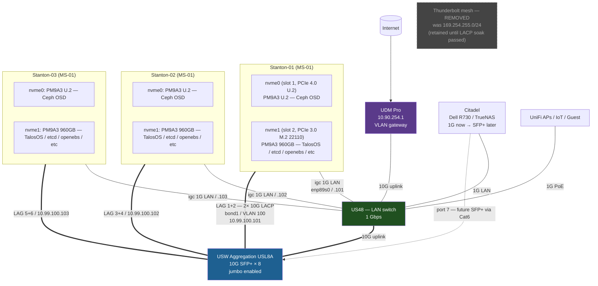

> *"Verify configuration claims against vendor docs, not from intuition or partial recall."*

## Why I'm doing this

A bit over a year ago I set up a Thunderbolt mesh between three [Minisforum MS-01](https://store.minisforum.com/products/minisforum-ms-01) mini PCs running Talos Linux for my Ceph storage replication. I wrote it up as [a public gist](https://gist.github.com/gavinmcfall/ea6cb1233d3a300e9f44caf65a32d519) at the time. It's been working well enough, mostly — Ceph replication over Thunderbolt clocks at about 26 Gbits/sec on iperf3, which is faster than any switch I own.

The problem isn't bandwidth. The problem is **reliability across reboots**. Every time a Stanton node reboots — for a Talos upgrade, a kernel update, or because some unrelated thing went sideways — the Thunderbolt ring has a non-trivial chance of coming back broken. The kernel resets the USB4 host router during driver init, and on MS-01 hardware that reset sometimes leaves the port enumerated but with no link. The fix is to physically unplug and replug the cable.

I [wrote about this last week](/2026/three-990-pros-all-dying-part-1/) — when a Samsung 990 PRO died at 2am, the recovery was made significantly worse by the Thunderbolt ring half-breaking after the node rebooted. A single dying disk turned into a four-hour cluster-wide alert storm because the cluster network couldn't form properly until I went and physically wiggled cables.

I [applied a kernel argument](https://blog.nerdz.cloud/2026/three-990-pros-all-dying-part-1/) — `thunderbolt.host_reset=0` baked into a custom factory.talos.dev schematic — that fixes the boot-time enumeration problem. Verified working: all three Stantons now show both Thunderbolt ports up after every reboot. But the runtime peer-disconnect issue still happens. When one node reboots, the *other* nodes' running Thunderbolt stacks can wedge, requiring cable hot-plugs to recover.

It's been enough pain that I've decided to migrate Ceph off Thunderbolt entirely and onto a proper switched fabric.

## The original plan and why it stalled

Last month I had a long conversation with Claude about how to redesign the network. The end result was [`docs/ai-context/PHYSICAL-CONNECTIVITY.md`](https://github.com/gavinmcfall/home-ops/blob/main/docs/ai-context/PHYSICAL-CONNECTIVITY.md), a V2 connectivity profile. The conclusion was: single 10G cable from each Stanton to a new UniFi Aggregation switch, keep the 1G copper as automatic backup, **leave Ceph on Thunderbolt**.

The reasoning for keeping Ceph on Thunderbolt was: link aggregation across two 10G cables wouldn't help Ceph traffic. The thinking was that the Aggregation switch could only hash by source/destination MAC address and IP address — not by TCP/UDP port — so any single Ceph OSD-to-OSD flow would pin to one physical link in the bond and never get the bandwidth benefit of having two cables.

That was the wrong assumption. I've been sitting on six 1m direct-attach copper cables waiting to do this migration, and revisiting the question this week, I caught the mistake.

## What changed my mind

When I asked Claude to actually verify the hash limitation against current Ubiquiti documentation, it scraped [the official Port Aggregation FAQ](https://help.ui.com/hc/en-us/articles/360007279753-Port-Aggregation-FAQs) and found that **all UniFi switches except USW-Flex, USW-Flex-Mini, and USW-Ultra support layer 3 + 4 hashing** — and the hash policy is user-configurable in the controller. The USW Aggregation (model USL8A) is in the supported set.

Cross-confirmed:

- [Talos Linux's official bond documentation](https://docs.siderolabs.com/talos/v1.12/networking/logical/bond) shows `xmitHashPolicy: layer3+4` as a documented example for `bondMode: 802.3ad`. No hidden gotchas.
- Multiple homelab deployments running 3-node Minisforum MS-01 + UniFi Aggregation + dual-10G LACP for Ceph have been [documented and benchmarked](https://www.virtualizationhowto.com/2026/02/i-built-a-5-node-proxmox-and-ceph-home-lab-with-17tb-and-dual-10gb-lacp/), with sustained Ceph replication traffic in the multi-gigabit-per-second range.

Layer 3+4 hashing means the load balancer uses the TCP/UDP port numbers in the hash. Ceph OSDs open many parallel TCP connections per pair, each with different source ports — those connections distribute across both physical cables in the bond. Aggregate bandwidth approaches 2× the per-link speed for multi-stream workloads.

So I was leaving capacity on the table because I'd believed something untrue. Worth checking with vendor docs in 2026 before designing around a constraint that doesn't exist.

## The new topology

Each Stanton MS-01 has:

| Interface | Speed | Driver | Currently used for |
|-----------|-------|--------|---------------------|
| 2× SFP+ ports (X710) | 10 Gbps each | i40e | Both unused |
| 2× RJ45 (i225/i226) | 2.5 Gbps each | igc | One for LAN, one unused |
| 2× Thunderbolt 4 ports | ~20 Gbps theoretical | thunderbolt | Ceph mesh |

The new design uses both 10G fiber-style ports together as a single bonded link dedicated to Ceph, on its own VLAN. The 1G copper stays exactly where it is for LAN. Thunderbolt comes out at the end, but only after the new fabric is validated.

```
Stanton-01:
  SFP+ port 0 ─┐
                ├── bond1 = "Ceph fabric" (LACP, ~20G)  → USW Aggregation
  SFP+ port 1 ─┘                                          (VLAN 100, 10.99.100.0/24)

  RJ45 (igc enp89s0) ─── eth0 = LAN (no change)         → US48 (1G)

  Thunderbolt 0/1 ─── kept until validated              → other Stantons
                       (then unplugged)
```

Each node gets:

- **bond1** — both SFP+ ports bonded together, LACP with layer-3+4 hash policy, jumbo frames (MTU 9000), tagged for VLAN 100. Carries only Ceph cluster_network traffic. Address `10.99.100.101/24` (Stanton-01), `.102` (Stanton-02), `.103` (Stanton-03).
- **eth0** — single 1G RJ45 to US48. No bond. No change from today. Address `10.90.3.101/16` etc.
- **Thunderbolt** — leave as-is during the migration. Cables stay plugged in. Talos config keeps the existing TB interface stanzas. Ceph still has TB as a known cluster_network path.

Zoomed-out, the whole cluster looks like this once the migration completes and the Thunderbolt cables come out:



The drives are also part of the story — both nvme1s in each Stanton are being replaced with the Samsung PM9A3 M.2 22110 drives I'm waiting on (covered in [Part 1 of the SSD post](/2026/three-990-pros-all-dying-part-1/)). The U.2 PM9A3s in nvme0 stay where they are.

### USW Aggregation port allocation

| Port | Use |
|------|-----|
| 1 | Stanton-01 SFP+ port 0 (Ceph bond, member 1) |
| 2 | Stanton-01 SFP+ port 1 (Ceph bond, member 2) |
| 3 | Stanton-02 SFP+ port 0 |
| 4 | Stanton-02 SFP+ port 1 |
| 5 | Stanton-03 SFP+ port 0 |
| 6 | Stanton-03 SFP+ port 1 |
| 7 | Reserved — Citadel (NAS, coming later via RJ45-to-SFP+ transceiver) |
| 8 | Uplink to US48 (existing) |

All 8 ports used. Three two-port LAGs configured on the switch (one per Stanton), each tagged for VLAN 100 only.

### Why a separate fabric and not one big bond for everything

The alternative to this was a single bond per Stanton carrying both LAN and Ceph traffic on the same two cables. Less hardware, simpler config. The reason I'm splitting them: **independent failure domains**. If the Aggregation switch dies, Ceph is dead but LAN keeps working through US48. If US48 dies, LAN drops but Ceph traffic over the Aggregation is unaffected. Two separate switches means two independent things to fail.

The cost is more cables and slightly more complex config. Worth it for me — Ceph being able to fail independently of routine LAN issues is exactly the kind of resilience I want.

## Hardware inventory

Pulled live from each Stanton via `talosctl get links` and `lspci`:

| Host | X710 SFP+ port 0 | X710 SFP+ port 1 | igc port (LAN) |
|------|------------------|------------------|----------------|
| Stanton-01 | `enp2s0f0np0` — `58:47:ca:76:16:cf` | `enp2s0f1np1` — `58:47:ca:76:16:d0` | `enp89s0` — `58:47:ca:76:16:d2` |
| Stanton-02 | `enp2s0f0np0` — `58:47:ca:76:0b:fb` | `enp2s0f1np1` — `58:47:ca:76:0b:fc` | `enp89s0` — `58:47:ca:76:0b:fe` |
| Stanton-03 | `enp2s0f0np0` — `58:47:ca:76:0e:db` | `enp2s0f1np1` — `58:47:ca:76:0e:dc` | `enp89s0` — `58:47:ca:76:0e:de` |

The X710 controller exposes both SFP+ ports under driver `i40e`. The 2.5G copper ports are driver `igc`.

## The Talos bond config

Add a second interface stanza to each Stanton's `networkInterfaces` block in `talconfig.yaml`. Existing `bond0` (the 1G LAN bond — though it's currently a single-member bond with just `igc enp89s0`) stays as-is. New `bond1` is added for Ceph.

### Stanton-01

```yaml
- interface: bond1
  bond:
    mode: 802.3ad
    miimon: 100
    xmitHashPolicy: layer3+4
    lacpRate: fast
    deviceSelectors:
      - driver: i40e
        hardwareAddr: "58:47:ca:76:16:cf"   # X710 SFP+0
      - driver: i40e
        hardwareAddr: "58:47:ca:76:16:d0"   # X710 SFP+1
  vlans:
    - vlanId: 100
      mtu: 9000
      addresses:
        - "10.99.100.101/24"
  dhcp: false
  mtu: 9000
```

### Stanton-02 / Stanton-03

Same shape, swap the MAC addresses and the address per the table above.

A few notes on the bond options:

- `mode: 802.3ad` is LACP. Both ends — Talos and the switch — must agree.
- `xmitHashPolicy: layer3+4` is what gives us the per-connection distribution. Hashes by IP and TCP/UDP port. Required for Ceph's many-parallel-flows pattern to actually use both cables.
- `lacpRate: fast` makes the protocol exchange "I'm alive" packets every second instead of every 30. Failover is faster when a cable goes down.
- `miimon: 100` is the link-state poll interval. 100ms is the standard tuning.
- `mtu: 9000` is jumbo frames. The Aggregation switch and both cable endpoints all need to be set to this. The switch defaults to 1500.

## The UniFi Aggregation switch config

In the UniFi controller, on the USW Aggregation:

1. **Network → Settings → Networks → Add new network**: Name `Ceph`, VLAN ID `100`, subnet `10.99.100.0/24`, no DHCP server, no inter-VLAN routing required.
2. **Settings → Profiles → Switch Port → Add port profile**: Name `Ceph-LAG-member`, native VLAN none, tagged VLAN 100 only. Apply to ports 1, 2, 3, 4, 5, 6.
3. **Devices → USW Aggregation → Port Manager**: pair ports 1+2 into a port aggregation group (LAG) for Stanton-01. Repeat for ports 3+4 (Stanton-02) and 5+6 (Stanton-03). On each LAG, set hash algorithm to **Layer 3 + 4**.
4. **Devices → USW Aggregation → System → Jumbo Frames**: enable. This applies switch-wide; the existing US48 uplink will negotiate up to whatever the other end supports (US48 also needs jumbo frames enabled if you want jumbo packets to traverse).

All three LAGs need to be configured on the switch *before* any Talos config is applied, otherwise the bond fails to form.

## Migration plan

The big constraint: **don't change Ceph's `cluster_network` config until after the new fabric is verified working**. Ceph keeps using Thunderbolt during the cutover. The new bonded interface comes up alongside, gets validated by hand, and only then does the Ceph daemon configuration change to use the new path.

Per-node sequence, one Stanton at a time:

1. **Cable both SFP+ ports** from the Stanton to the Aggregation switch ports for that node's LAG. Confirm both links come up at 10G in the controller. No traffic flows yet because Talos doesn't know about them.
2. **Apply the new Talos config** with `bond1` defined. Talos reboots the node. After reboot, `talosctl get links` shows `bond1` up with both members.
3. **Verify the bond from inside the cluster**:
   ```bash
   talosctl --nodes 10.90.3.101 read /proc/net/bonding/bond1
   ```
   Should show `Bonding Mode: IEEE 802.3ad Dynamic link aggregation`, `Aggregator ID: <x>`, both slave interfaces in `link: up`, `Aggregator Selection Policy: stable`.
4. **Test bandwidth and latency on the new fabric** between this node and either of the others (which haven't migrated yet, but their TB-side IPs are still reachable for now — actually, this needs both ends migrated; see below).

Once two nodes are migrated, the new fabric carries traffic between them at 10G+. iperf3 between the two on the new VLAN should show close to 20 Gbps with multiple parallel streams.

5. **After all three Stantons are migrated**: validate Ceph can talk over the new fabric. Add `10.99.100.0/24` to Ceph's `cluster_network` config in the cluster manifest. Ceph daemons pick up the additional path on next reload — they'll now have two cluster_network options, Thunderbolt (`169.254.255.0/24`) and switched (`10.99.100.0/24`).
6. **Run the cluster on both paths for a week**. Watch for any odd behaviour — drops, latency spikes, anything in `ceph -s` complaining.
7. **If it's all clean**: remove `169.254.255.0/24` from `cluster_network`, unplug the Thunderbolt cables. Done.

If anything goes wrong at step 4 or 5, the Thunderbolt mesh is still there. Roll back the talconfig.yaml change, reboot, you're back to the existing topology.

## Coming in part 2

When this all happens — drives in hand, cables run, switch configured, Talos applied — I'll write a part 2 with:

- iperf3 baseline (Thunderbolt) vs after-migration (LACP bonded)
- Ceph rebalance time before vs after for a 1TB OSD
- Whatever weird thing inevitably surfaced during the cutover
- The decision on whether to fully retire Thunderbolt or keep it as a fallback

It'll probably also cross over with [Part 2 of the SSD replacement post](/2026/three-990-pros-all-dying-part-1/) since both projects are in the same window. The new enterprise drives arrive between 29 May and 22 June; the network migration can happen any time the cluster is healthy. If the timing works out, I'll do them back-to-back so the cluster only has one disruption window.

For now, six 1m DAC cables sitting on my desk, switch config drafted, Talos config drafted, network plan locked. Just need a clear evening to actually pull the trigger.
