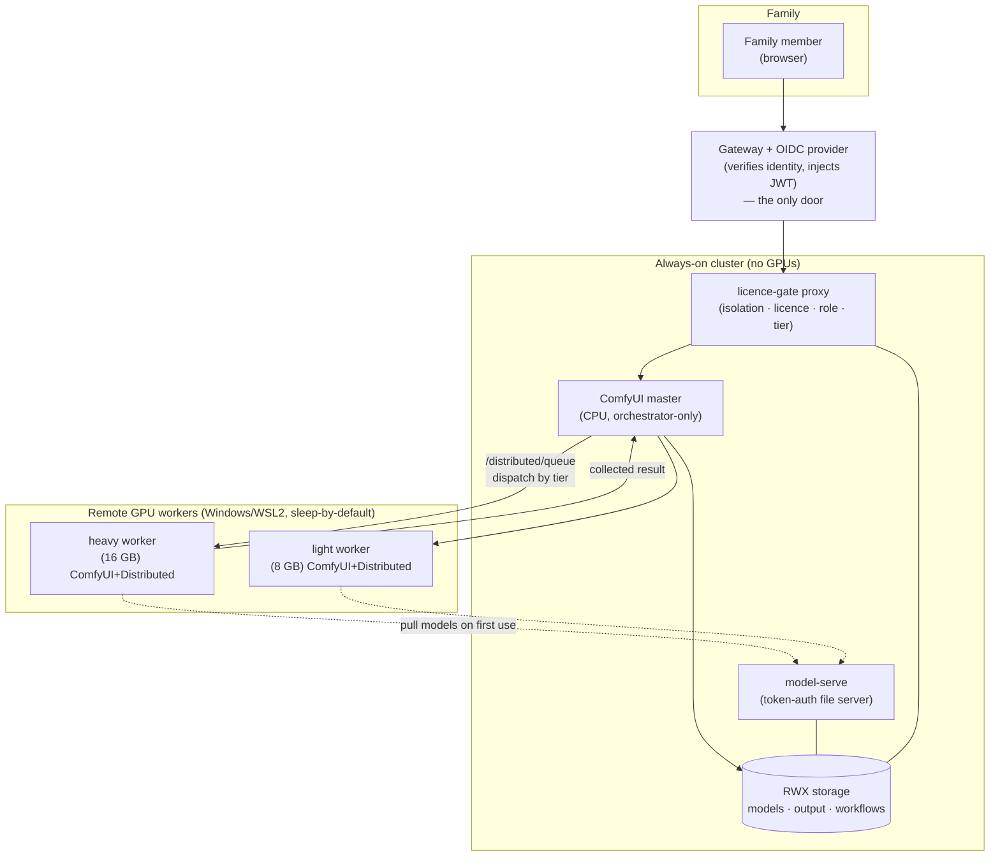

> The PC was asleep when I asked for the renders. It was asleep again when I closed the tab. I was billed for zero of them.

A Saturday afternoon. I'm worldbuilding for something, and I want a batch of twelve concept images. I queue them up, walk away, and come back ten minutes later to find them dropped into my own output folder. Somewhere along the way, a 16 GB gaming PC that had been asleep for a day and a half woke up, did the work, and went back to sleep. I never opened a cloud tab, never paid per image, never thought about which machine did it. If one of the images had been earmarked for a brand asset, I wouldn't have had to remember which models are licence-clean — the system wouldn't have let me pick a wrong one.

That's Lighthouse. This post is the *why*, the *shape*, and the engineering decisions that made it the way it is. The step-by-step *how-to* is the next post — a multi-chapter guide called *"How to build a self-hosted AI image generation studio that uses the hardware you already have"*.

## The three costs cloud image generators charge

Cloud image generators have three costs a family feels:

- **Money.** Per-image, per-seat, forever. The bill goes up the more useful the tool gets, which is exactly backwards.
- **Privacy.** Your prompts, your outputs, your reference images — they live on someone else's servers, with somebody else's retention policy.
- **Control.** Shared accounts mean everyone sees everyone's work. There are no real per-person boundaries. Content rules are set by someone in another country who has never met your kids.

And the hardware to do it locally is *already in the house* — gaming PCs with capable GPUs that sit idle for twenty-two hours of every day.

The argument writes itself: use the GPUs that are already here, only when someone needs them, and put hard boundaries between people that a cloud service can't or won't.

That's the workhorse — image generation that just works, for the whole household, on hardware that's paid for. It's what's built today and what this post is about. There's a deeper reason the project exists too — a private, patient assistant for two neurodivergent kids who refuse every mainstream cloud AI, precisely because cloud AIs feel surveilled and impersonal. The same foundations the image generator needs (identity, per-person isolation, role boundaries, local-only data, appliance-grade operations) are the foundations the assistant needs. Image generation is the first, most tangible proof that the foundation works. The assistant is designed but not built; I'll come back to it when it is.

## What "great" looks like

These are the testable promises the built system keeps. If a future change breaks one of them, the system has regressed:

- **Sleep-by-default, opportunistic compute.** The GPU PCs sleep by default and wake on demand. A person sitting down at a PC always wins over inference — gaming or working on a PC takes precedence the moment it's touched.
- **Everyone generates; everyone is isolated.** Each family member generates images and sees only their own outputs. Never another member's. Enforced at the proxy, not assumed by ComfyUI.
- **Dispatched across the fleet.** Batches fan out across available GPUs in parallel, waking only as many machines as the work needs.
- **Licence-clean by construction.** A commercial or brand job is *never* rendered with a non-commercial model — the gate makes it impossible, not merely discouraged.
- **Tiered to the hardware.** Bigger models on the bigger cards (heavy tier), lighter ones on the smaller cards (light tier), without the user choosing.
- **Family-safe content boundaries.** Mature-capable models are scoped to a specific role; the rest are open to the whole household. Role membership comes from the identity provider and is enforced at the proxy.
- **Private and gated.** Reachable only behind single sign-on; never exposed to the public internet in a way that risks the host machines.
- **Appliance-grade.** Declared in Git, reconciled automatically, observable. Not a hobby that needs hand-tending.

The bullet that took the most engineering to keep is the first one. Everything else is a configuration of well-known parts. Sleep-by-default with sub-two-minute wake from cold is what made the project worth doing instead of buying a cloud subscription.

## The shape — three tiers and one rule

There are three tiers in the system, and one rule about how identity flows through them that you don't get to vary.

### Three tiers

1. **Remote GPU workers** — the family's Windows PCs, GPUs *outside* the cluster. Each runs ComfyUI plus the ComfyUI-Distributed plugin inside WSL2, exposes `:8188` on the LAN, sleeps by default, and is woken on demand.
2. **The always-on cluster** — a small Kubernetes cluster running the *control* side: a CPU-only ComfyUI **master** (orchestrator), the **licence-gate** proxy (the security boundary), and a **model-serve** sidecar. No GPUs here.
3. **Ingress** — the only door: an HTTP gateway doing OIDC auth (verifying the user's identity, injecting a verified JWT) in front of the licence-gate.

Solid arrows are the render path; dotted are model pulls. **The master never renders.** It validates the workflow graph, dispatches to a worker over ComfyUI-Distributed, and saves the collected result to per-user storage. The workers do the actual rendering.

### The one rule

The gateway **verifies** the OIDC token; the licence-gate **only decodes** it. Those are two different verbs. The gate trusts that anything reaching it has already had its identity proved by the gateway upstream.

That is safe **only** because a NetworkPolicy makes the licence-gate unreachable from anywhere except the gateway and the worker subnet. Expose the gate directly and anyone on the LAN can forge a JWT, claim any user, claim any role, and walk through every boundary in the system. The verification has to happen *exactly once*, in *exactly one place*, and *every other component has to trust that place*.

If you take one thing from this post: when you're chaining identity through a stack of services, **pick one verifier and shape the network so nothing can skip it**. Decode is cheap; verify is the boundary.

## The constraints that shaped the design

This is the part I find interesting, because every one of these was a real argument I had with myself before settling on it.

### GPUs are gaming PCs, not servers

I considered putting the GPUs *into* the cluster as kubelet nodes. Adding a Windows PC as a node, kicking off a render via a pod, watching kubectl light up — there's a satisfying purity to it.

It doesn't survive contact with reality. A kubelet expects an always-up node. The sleep/wake lifecycle plus WSL2 GPU passthrough plus the kubelet's heartbeat assumptions is a Rube Goldberg setup that breaks in interesting ways. And — more importantly — those PCs hold the family's personal Windows data. A compromised image-gen workload on a cluster node is one step from a compromised household.

So the GPUs sit *outside* the cluster as plain LAN backends. The cluster sees "healthy backend or not". The power model is bespoke and not Kubernetes' problem. Compromise containment is the win.

### Orchestrator-only master, dumb workers

The ComfyUI master in the cluster is CPU-only and doesn't render. It validates the workflow graph against the allowlist, then dispatches to a worker via the Distributed plugin, waits for the collected result, and writes it to the user's bucket. The workers are interchangeable render nodes that know nothing about identity, licensing, or roles.

This is one identity-aware policy point in front of every render. Add another worker — even a different vendor's GPU — and it inherits the policy for free.

### Per-user isolation in a proxy, not in ComfyUI

ComfyUI has no multi-tenancy. Out of the box, everyone shares one space and one output folder. There are auth plugins, but they're full login systems that don't trust an upstream JWT — exactly the wrong shape for "gateway already proved who this person is, do not log them in again."

So per-user isolation is in a bespoke Go proxy in front of ComfyUI. The proxy decodes the JWT, rewrites the `SaveImage` filename prefix to a per-user bucket (`<user-uuid>/...`), scopes reads to that bucket, and returns an identical 404 for both "not yours" and "doesn't exist" so you can't probe for other users' filenames. The same proxy also does the licence/role/tier gating, because if you've already got an identity-aware policy point, you put the policies there.

### Licence-clean by construction, not by reminding myself

The brand-asset case is a clean example. Some image-generation models are commercially-licensed and some aren't. The boring answer is "remember which models you can use for commercial work." The boring answer is wrong, because eventually you'll forget, and a non-commercial model will end up under a brand asset, and the licence violation is impossible to undo after the fact.

The licence-gate resolves *every* model reference in a submitted workflow against a registry. If a job is tagged commercial and any model in the graph is non-commercial, the request is rejected. The user can't pick a wrong combination because the wrong combinations don't reach the worker. Mistakes that can't happen don't have to be remembered.

### Role-gating on the model tag, not the workflow

Maturity boundaries (mature-capable models gated to one role, the rest open to the whole household) get enforced on the model itself, not on a specific workflow file. A per-workflow allowlist is craftable-around: you fork the workflow, change a node, send it in. A per-model tag isn't — if the model is tagged `mature`, the request needs the `mature-content` group claim or it never reaches a worker that has the model.

The general shape is: gate on the thing you can't substitute. The workflow is data the user controls; the model registry is data you control.

### VRAM is the ceiling, jobs stay on one card

Real cards are 16 GB and 8 GB, not 24 GB. Cross-machine VRAM pooling exists in theory; on a home LAN it pays a brutal latency price for a marginal win, and even when it works the model you fit isn't worth the speed penalty. So jobs stay on one card. Tier-aware dispatch picks an appropriately-sized worker for the model. SDXL never lands on an 8 GB card. OOMs don't happen on the happy path.

### Sleep-wake-CUDA was the scariest unknown

The whole "near-free at rest" promise rode on a single question: would a Windows gaming PC, sleeping, wake on a LAN packet, bring WSL2 back up, and resume CUDA cleanly enough to serve a render? If the answer was no, the project was dead and I'd just rent a cloud GPU like a reasonable person.

The answer is yes. The first wake-and-render took about ninety seconds from cold, and the GPU came back cleanly. There are still rough edges — automated wake is currently a manual PowerShell script (a controller is designed, not built; see "what isn't done"), and a person sitting at the PC during a wake needs to be handled gracefully. But the load-bearing technical risk is gone.

## What isn't done yet

I'm allergic to blog posts that present a working system and then nine more in a "coming soon" footer. So here's the explicit version:

**Built and running:**

- OIDC-gated ComfyUI image-gen, served via the licence-gate.
- CPU orchestrator master, dispatching to LAN GPU workers via ComfyUI-Distributed.
- Per-user isolation (write-rewrite + read-scope + canonical 404s).
- Licence/role/tier gating on every submitted workflow.
- Heavy + light tier dispatch.
- Sleep + manual Wake-on-LAN.
- Curated workflows, SDXL + HiRes-fix as the first base workflow.

**Designed, not built (do not let me sell you these):**

- Automated Wake-on-LAN controller (the manual `wol.ps1` is the stopgap).
- LLM routing alongside image-gen on the same workers.
- Family-data / provenance store for the assistant.
- The MCP seam to Cortex.
- The branded family portal and voice assistant.

**Known open bugs:**

- The App Mode "Generated" gallery doesn't surface images that are on disk — the renders work, the UI just doesn't list them yet.
- The Jobs panel has a parse error.
- The Impact-Pack SAM editor hits a `.js` MIME quirk.

Those are real and I'm working on them. They aren't reasons not to use the system, but they're the things you'll find on day one.

## What's next on this blog

The next post is the actual *how-to* — the full reproduction guide for someone who has a cluster, two gaming PCs, and a free Saturday. The capability contract (you do not need my stack — Flux *or* Argo, Ceph *or* NFS, Pocket-ID *or* Authelia *or* Keycloak), the worker setup (WSL2 + CUDA + ComfyUI + Distributed + autostart + WoL + firewall), the three container images and how they're built, the reference Helm deploy, the registry / allowlist / gpu_config formats, and the gotchas chapter that I'm pretty sure is going to be the most-read part.

If you want a preview of the security model — the licence-gate's `gateway verifies, gate decodes, network enforces` invariant turned into a working set of NetworkPolicy + JWT decode + workflow allowlist — that's the section I'm proudest of and the first chapter I'll publish.

Comments / questions / "you should have used X" — DM me, or the contact link in the colophon below works.
