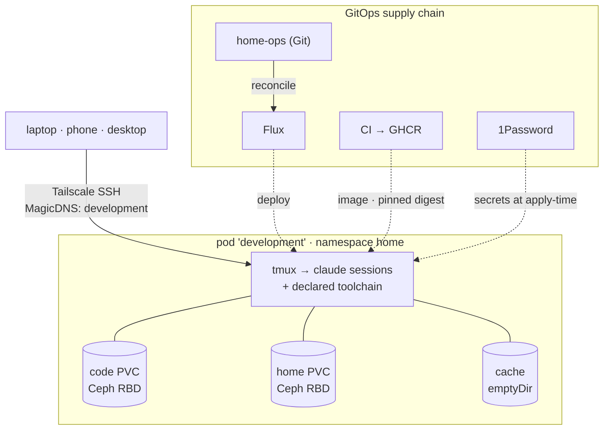

> I rebooted the machine my entire development life used to run on. I didn't think twice. By the time Windows came back up I'd already reconnected to all eight of my sessions — from a different computer — because they were never on that machine to begin with.

For years my dev environment was a single WSL2 distro on a single Windows desktop. Every repo, every shell, every long-running [Claude Code](https://claude.com/claude-code) session lived inside one Linux instance that only existed because one Windows machine was switched on. It worked. It was also the most precious, least reproducible thing I owned — a snowflake I was terrified to reboot, pinned to a box I increasingly wanted to wipe.

So I evicted it. My development environment now lives where everything else I run lives: **in my Kubernetes cluster.** It's a persistent pod on the tailnet called `development`, I reach it over Tailscale SSH from any device, and it survives reboots I don't think about because it isn't on a device I reboot.

This post is the *why*, the *shape*, and — because this is the interesting part — the **eight things that fought me on the way in**. If you're tempted to do the same, the war stories are the value. The happy path is three paragraphs; the gotchas are the post.

The build assets are public if you want to read along:

- **The image** — [`gavinmcfall/development-container`](https://github.com/gavinmcfall/development-container) (config-driven Dockerfile, CI to GHCR)
- **The manifests** — [`gavinmcfall/home-ops`](https://github.com/gavinmcfall/home-ops/tree/main/kubernetes/apps/home/development-container) (HelmRelease, PVCs, ExternalSecret, the auto-sync CronJob)
- **The dotfiles** — [`gavinmcfall/dotfiles`](https://github.com/gavinmcfall/dotfiles) (chezmoi, secrets via 1Password references only)

## Why move a dev box into a cluster at all

A laptop — or a WSL2 distro on a desktop — is the wrong place for the environment you do all your work in, for three reasons I feel constantly:

- **It's fragile.** WSL2 with systemd needs a process kept alive or the distro winds down. My "dev environment" was, functionally, one `sleep infinity` away from disappearing, babysat by a Windows Task Scheduler job. That's not infrastructure, that's a held breath.
- **It's pinned.** The work only exists where the machine is. Reboot the desktop and every session dies. Want to pick up from the couch on a different machine? You can't, not really.
- **It's a snowflake.** The toolchain accreted over years of `apt install` and `brew install` and "I'll remember why I did that." Nothing was declared. Nothing was reproducible. Rebuilding it was a day I kept not having.

Everything else I run solved these problems years ago by living in the cluster: declared in Git, reconciled by [Flux](https://fluxcd.io/), reachable over [Tailscale](https://tailscale.com/), backed by [Rook-Ceph](https://rook.io/) storage I don't hand-tend. My dev environment was the last hand-fed pet in a house full of cattle. So I made it cattle too.

## What "great" looks like

These are the testable promises the system keeps. If a future change breaks one, it's a regression:

- **It outlives its hosts.** Reboot any of my machines — the pod and every session in it keep running. The environment is reachable, not resident.
- **One door, from anywhere.** `ssh gavin@development` from any tailnet device drops me into `tmux` with every session where I left it. Auth is the tailnet's, not a password's — no public SSH port exists.
- **The toolchain is declared.** Every package, binary, and language runtime is one line in a YAML file. Adding a tool is a commit, not an afternoon. The image builds in CI.
- **State is layered by how precious it is.** Repos on one volume, home/dotfiles on another, caches on throwaway storage. I can wipe and rebuild the disposable layers without touching the precious ones.
- **No secret is on disk in the clear, and no secret is in Git.** The dotfiles are a *public* repo. Every secret resolves from 1Password at apply-time; the repo holds pointers, never values.
- **It's GitOps the whole way down.** The image, the pod, the storage, the secrets wiring — all declared, all reconciled, all observable. The only clicks are the ones the platforms genuinely require.

## The shape



The build splits cleanly in two.

**The image** is an Ubuntu 24.04 container built from a *config-driven* Dockerfile. Instead of a wall of `RUN apt-get`, there's one YAML file per install type — `apt.yaml`, `binaries.yaml`, `scripts.yaml`, `npm.yaml`, `languages.yaml` — each consumed by a small POSIX installer. Adding `ripgrep` or pinning a new `kubectl` is a one-line edit. The Dockerfile is a thin driver over that config. It builds in GitHub Actions and pushes to GHCR. Personal data and dotfiles are explicitly *not* in the image — they live on a volume.

**The deployment** is a [bjw-s `app-template`](https://github.com/bjw-s-labs/helm-charts) HelmRelease in my home-ops repo. Two Rook-Ceph RBD volumes — one for `~/code` (the repos), one for the rest of `$HOME` (dotfiles, `~/.claude`, config) — plus an `emptyDir` for caches. The container runs `sleep infinity`; `tmux` is attached over SSH, not run as PID 1.

I didn't guess the memory envelope. I ran a profiler against the real WSL2 workload for a few days first: per-session resident set landed around 1.6 GB, peak whole-environment usage around 21 GB (my first back-of-envelope guess had been 3× too high). So the pod requests 16 GB and limits at 28 GB, with a high priority class so it's the *last* thing evicted. Measure, then size.

**The front door** is Tailscale. The cluster already runs the Tailscale operator, but exposing a pod as its own SSH-able tailnet node was new ground: the pod runs `tailscaled` in userspace-networking mode and brings up **Tailscale SSH**, registering as MagicDNS `development`. There's no `sshd`, no password, no exposed port — login is authorized by tailnet ACLs. One `ssh gavin@development -t 'tmux new -A -s main'` and I'm home.

That's the happy path. Here's where it actually got interesting.

## Eight things that fought me

### 1. Tailnet Lock locked the node out of its own tailnet

The pod came up, `tailscaled` started, and then… nothing. `tailscale status`: *Logged out / NeedsLogin*. The logs said `machineAuthorized=false` and handed back an auth URL, which is the signature of a key that isn't pre-authorizing the node.

I spent too long suspecting the auth key. It was fine — reusable, correctly tagged. The real culprit was **Tailnet Lock**: I have it enabled, which means a new node has to be *cryptographically signed by a trusted key* before the network will trust it. A locked-out node doesn't error loudly; it just quietly fails to authorize and falls back to interactive login. The fix was one command from an already-trusted machine:

```
tailscale lock sign nodekey:… tlpub:…
```

**Lesson:** if you run Tailnet Lock, every *programmatically* created node — every pod, every ephemeral container — needs signing, and the failure mode looks exactly like a bad auth key. Check `tailscale lock status` before you tear your hair out.

### 2. A 45 GB seed at 1 MB/s

With the pod authorized, I needed to move ~45 GB of repos and `~/.claude` history onto the volumes. Naturally: `rsync` over Tailscale SSH. It crawled. About **1 MB/s**.

The cause is subtle and worth knowing. The pod's `tailscaled` runs in *userspace networking* mode, which can't establish a direct LAN path — so every byte relayed through the nearest DERP server (Sydney, ~700 ms round trip from New Zealand). `rsync`'s small-block chatter over a 700 ms relay is death by latency.

The fix was to stop using the network at all. `rsync` can run over an arbitrary transport via `--rsh`, and `kubectl exec` *is* a transport:

```bash
# rsh wrapper: ignore the host arg, exec into the pod instead
shift; exec kubectl exec -i -n home "$POD" -- runuser -u gavin -- "$@"
```

```bash
rsync -aHAX --rsh=./kubectl-rsh ~/code/ rsync:/home/gavin/code/
```

That pushes the bytes through the Kubernetes API server over the LAN instead of bouncing off a DERP relay on another continent. Same `rsync`, **~87 MB/s**. (One trap: no `-t`/TTY — a pseudo-terminal corrupts the binary stream.)

**Lesson:** a userspace-networking pod has no fast LAN path. For bulk data, `rsync`-over-`kubectl exec` beats `rsync`-over-Tailscale-SSH by ~80×.

### 3. The whole-home mount ate my toolchain

I wanted *all* of `$HOME` on the persistent volume so nothing fell through the cracks. But the image bakes its toolchains into `$HOME` too — `~/.nvm`, `~/.cargo`, `~/.local/bin`, oh-my-zsh. Mount an empty volume over `/home/gavin` and you've just *hidden everything the image installed there*. The pod booted with no Node, no Rust, no `claude` on PATH.

The resolution is a clear mental split: the image owns the *toolchain*, the volume owns the *data and dotfiles*, and you seed the toolchain's per-user bits onto the volume once (or keep system-wide tools out of `$HOME` entirely). A `node_modules`-style denylist during the seed also quietly stripped my global npm packages out of `~/.nvm` — so `codex` and `gemini` vanished until I re-seeded that path.

**Lesson:** mounting over `$HOME` shadows anything the image put there. Decide what's "toolchain" (image) vs "data" (volume) explicitly, because the volume always wins at runtime.

### 4. Secrets, so the dotfiles could be public

I wanted my dotfiles in a *public* chezmoi repo — which means not a single secret can touch them, and I had ~78 plaintext values in `~/.secrets`. So before anything got committed, those moved into 1Password.

The model that makes this safe is two files that look similar and are nothing alike:

- The **source template** (`private_dot_secrets.tmpl`, committed to the public repo) contains only *pointers*: `export FOO='{{ onepasswordRead "op://Vault/FOO/password" }}'`.
- The **rendered target** (`~/.secrets`, local only, `chmod 600`, never committed) is what `chezmoi apply` produces by resolving each pointer through 1Password.

The pod authenticates to 1Password with a *service-account token* (injected as an environment variable by an ExternalSecret), and chezmoi needs `[onepassword] mode = "service"` to use it. Get that wrong and `apply` fails with a maddening "account mode, but a service token is set." I templated that config too, so a fresh volume reseeds into the right mode automatically.

A bonus the migration surfaced: a plaintext GitHub PAT sitting in `~/.gitconfig` that was completely redundant (auth already ran through the `gh` credential helper). Moving secrets out is also a great excuse to find the ones that shouldn't have existed.

**Lesson:** a public dotfiles repo is the forcing function that finally makes your secret hygiene honest. Pointers in Git, values in a vault, real file rendered locally and never committed.

### 5. The build that failed silently, every single time

Here's the one that cost me the most before I saw it. My new tools (`nano`, `sops`, then a dozen more) just… never showed up in the running pod, no matter how many times I rebuilt. The CI runs were green-ish, the pod was on an old image, and I assumed the rollout was the problem.

It wasn't. Every build was *building* perfectly and then **dying at the push**:

```
denied: permission_denied: write_package
```

The GHCR package had been created once by a manual `docker push` during an earlier rename, which left it **unlinked from the repository**. An unlinked user-owned package doesn't grant the repo's Actions token write access — so every CI build for *days* compiled the whole image and got rejected at the last step. The "green-ish" runs were the build job succeeding; I'd never scrolled to the push.

The fix is a one-time grant (Package settings → *Manage Actions access* → add the repo with Write) plus an `org.opencontainers.image.source` label so the package stays linked forever after.

**Lesson:** "the build is green" is not "the image shipped." If a rebuild never changes the running artifact, read the *push* logs, not the build logs. And link your GHCR packages to their source repo.

### 6. The `:latest` cache trap

With the build finally pushing, I rolled the pod — and it came up on the *old* image again. The pull event was the tell:

```
Successfully pulled image "…:latest" in 9ms
```

Nine milliseconds is not a network pull of a 2 GB image; it's the node serving a cached `:latest` it already had. `imagePullPolicy: Always` re-checks the registry, but a stale local tag resolution won the race and the new digest never came down.

The fix is the one I should have started with: **pin the digest.** `tag: latest@sha256:…` forces the node to fetch exactly that image, and as a bonus makes deploys deterministic. (Renovate can bump the digest on rebuilds.)

**Lesson:** `:latest` plus `imagePullPolicy: Always` is not a guarantee — it's a suggestion a node cache can ignore. Pin digests for anything you actually want to roll.

### 7. podman, defeated by one kernel sysctl

I'd built in-pod container tooling so I could `docker build` without leaving my shell. Rootless `podman` installed cleanly. It could not run a single container:

```
cannot clone: Operation not permitted
user namespaces are not enabled in /proc/sys/user/max_user_namespaces
```

`/proc/sys/user/max_user_namespaces` was **`0`**. My nodes run [Talos](https://www.talos.dev/), which disables unprivileged user namespaces by default as a hardening measure — and without user namespaces, *neither* rootless nor root podman can construct a container. No pod-level setting overrides it; it's a node kernel policy.

I could enable it cluster-wide with a `machine.sysctls` patch, but I wasn't going to widen the kernel's attack surface across every node for the convenience of in-pod builds. My image builds already happen in CI. So I pulled podman back out and kept `skopeo` for inspection.

**Lesson:** rootless containers need user namespaces, and a hardened host can flatly refuse them. Check `cat /proc/sys/user/max_user_namespaces` before you plan a workflow around in-pod builds — and weigh the convenience against the hardening you'd be undoing.

### 8. A rotated CA and a ghost WSL path

The last two were quieter. Inside the pod, `kubectl` worked interactively but failed in scripts with `x509: certificate signed by unknown authority` — a stale standalone `~/.kube/config` carrying a CA from *before* the cluster's PKI was rotated. Symlinking it to the live, GitOps-managed kubeconfig fixed it and made it self-heal on the next rotation.

And on Windows, `kubectl` kept trying to read its config from `\\wsl.localhost\Ubuntu-22.04\…` — a path into a WSL2 distro I'd just retired. The culprit was a single line in my PowerShell `$PROFILE` hard-coding `$env:KUBECONFIG` at the dead path. The environment variable wins over the default config location, so even a perfectly good `~/.kube/config` never got a look-in.

**Lesson:** when you retire a machine, grep your *other* machines' shell profiles for paths that pointed into it. The dependencies you forget are the ones that were never written down.

## What it's like now

`ssh gavin@development`, and I'm in `tmux` with every project where I left it — `claude --resume` finds each session's full history because that history lives on the volume, not on whatever laptop I happened to close. A small CronJob runs `chezmoi re-add` hourly to capture any dotfile I edit directly, so the public repo stays current without me thinking about it. The toolchain is a folder of YAML I can read top to bottom. Reboots — mine, the desktop's, whatever — are a non-event.

The thing I keep coming back to is the **inversion of preciousness**. The expensive, irreplaceable thing used to be a Windows install I was afraid to touch. Now the expensive thing is two Ceph volumes that are backed up and declared, and every machine I own is a disposable window onto them. I can reinstall any laptop in the house on a whim. The work doesn't live there anymore.

That was always the promise of running your own cluster: turn pets into cattle. It just took me embarrassingly long to point it at the one pet I used every single day.

---

*Build assets: the [image](https://github.com/gavinmcfall/development-container), the [Kubernetes manifests](https://github.com/gavinmcfall/home-ops/tree/main/kubernetes/apps/home/development-container), and the [dotfiles](https://github.com/gavinmcfall/dotfiles). The image, the pod, the storage, and the secret wiring are all reconciled from Git — the only manual steps left are the two clicks GitHub and a vault genuinely require.*
